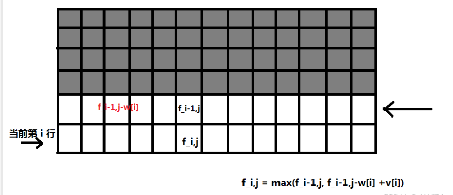
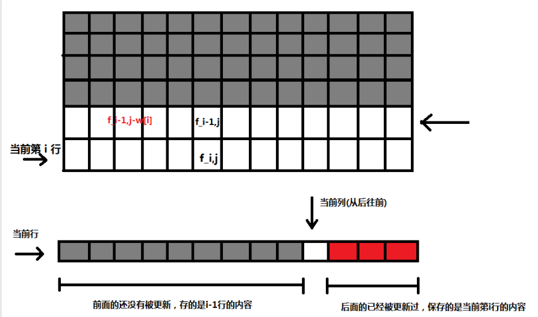
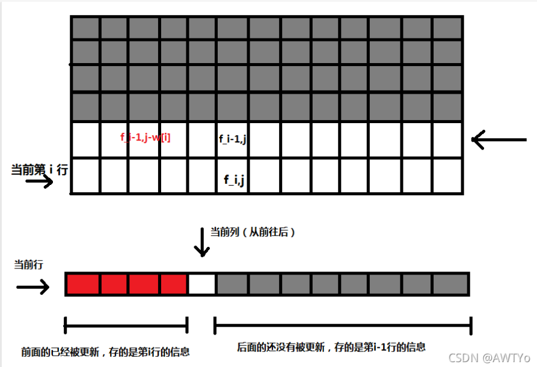

# 关于背包问题
&emsp; 这篇文章我不知道为什么，点击量会如此的高。我其他的文章点击量最多也就 40 多，这玩意儿直接就上三位数了。而且我寻思着我也没写讲解啊，就是四篇裸的代码啊，就很奇怪了~~可能是因为被背包问题困扰着的人太多了吧qwq~~。

&emsp; 那我想着没有解释点击量都这么高了，那我把解释写一下是不是点击量会更高呢qwq。所以现在我来写写关于背包 DP 的动态转移方程和所谓的一维背包优化是怎么回事 ~~会长点击量吗 qwq~~（更新于 2021.10.25）

----
## 0/1 背包
### 问题描述
&emsp; 就像我一开始只发了代码的时候在代码最下方的题目描述里写的那样，0/1 背包问题是你有一些物品（**每个物品只有 1 个**）和一个背包，每个物品有一个价值和重量，你的背包有一个承重上线，你想知道你带那些物品能够使得背包里面装进去的所有物品的价值总和最大。
### 0/1 背包与贪心
&emsp; 首先，这个问题看起来很简单，是不是算出每个物品的性价比，也就是价值与重量的比值，然后从大到小排序然后再一次往背包里面装就可以了呢？这应该是一个没接触过0/1背包问题的人第一次拿到这个问题想出来的第一个思路了吧（~~反正我第一次看到的时候是这么想的~~）。那么恭喜你，这种想法是错的。

&emsp; 我们来举个例子吧，比如你有三件物品，三个物品的价值和重量如下表：

|      | weight | value | ratio |
| --- | --------- | ------- | ----- |
| A  |    7kg   |  14RMB | 2 |
| B  |    6kg   |   11RMB|$\frac{11}{6}$|
| C  |    4kg   |  7RMB| $\frac{7}{4}$|
&emsp; 然后你还有一个容量为 10kg 的背包。

&emsp; 如果我们按照第三列从大到小放进背包的话，那么我们会发现，我们把第一个物品放进背包之后，我们就不能放其他的东西进去了，所以此时背包中的总价值为14RMB。但是如果我们选择后两个物品放进背包的话那么总价值就可以达到 18RMB 了，显然比第一种的要大。

&emsp; 所以这种贪心的策略之所以不成功是因为按照这种方案来装物品不能使背包的空间利用率达到最大。
### 正解：DP
&emsp; 一些废话（不想看的可以直接跳过）：

&emsp; 众所周知动态规划是一种 ~~玄学的~~ 高效的解决最值、方案数等问题的方法。这种方法之所以玄学，是因为他需要你有很好的数学推理能力 ~~和想象力~~。很多这类的题都是一听就懂，一做就废的类型，所以这玩意儿需要你慢慢 **悟**。然后再加上一定的刷题量才能真正的掌握（看你**悟性**高不高了qwq）。所以我们在这里说的内容可能不像我在其他篇里面写的那么有逻辑性，每一步都有具体的思路。对于背包问题就当学了个套路和解决问题的思路吧qwq。

&emsp; 在知道了贪心为什么不对之后，我们就来看看动态规划是怎么解决这个问题的。首先，我们假设 $f_{i,j}$ 试着把前 i 个物品装进容量为 j 的背包中时，背包中能够装下的物品的最大价值。那么我们现在来考虑如何写出动态转移方程。首先，我们假设我们计算到 $f_{i,j}$ 时前面的状态也就是 $f_{1, 1}，f_{1,2}，\cdots f{i-1,j-1}$ 都已经算出来了。然后我们要从这一堆已经算出来的状态中找到和当前和状态有关的状态们。

&emsp; 我们能想到，在选取第 i 个物品的时候我们能否选取会受到当前 j 和 w[i]（当前物品的重量）的限制，如果当前背包剩余能够装下的重量小于当前物品的重量（$j < w[i]$），那么第 i 个物品就不可能放进背包。所以在这种情况下，考虑前 i 个物品且背包剩余空间为 j 时的最大值就应该等于考虑前 i - 1 个物品且背包剩余空间还是为 j 的时候的最大值：
$$ f_{i,j} = f_{i-1,j} $$

&emsp; 第二种情况，就是第 i 个物品能够放进背包的情况，即（$j \geq w[i]$）。那么我们现在面临着两种选择（有且仅有这两种选择），
1. 不把第 i 个物品放进包里。
2. 把第 i 个物品放进包里。

&emsp; 在现在，我们肯定不知道哪种可能是更优的，所以我们分别找到这两种选择所对应的最大值，并比较他们俩，取他们俩之间较大的那一个。

&emsp; 首先是第一种：不把第 i 个物品放进包里。这一种情况和我们在上一个大类里面说的第 i 个物品不可能被放入背包其实是一样的（都是不放嘛）。所以这种情况下的转移值应该是：$f_{i-1,j}$
&emsp; 第二种情况：把第 i 个物品放进包里。这种情况稍微有些复杂了，因为我们把第 i 见物品已经放进去了，所以我们知道当前的背包容量是比上一个状态的背包容量大 $w[i]$ 的，那么上一个状态的背包容量就是 $j-w[i]$，而且我们知道这是 0/1 背包，每种物品只有一个，所以第 i 个物品放进去之后就不能再取到第 i 件物品了。体现在转移方程上就是前一个状态应该考虑前 $i - 1$ 件物品而不是前 $i$ 件（因为如果是前 $i$ 件的话，可能你在这次将 i 放进去之前就把 i 放进去过了）。那么我们就找到了这个状态的上一个状态为 $f_{i-1.j-w[i]}$。又因为第 i 件物品被放进去了，所以当前的价值是等于上一个状态的价值加上第 $i$ 个物品的价值 $v[i]$，即 $f_{i-1,j-w[i]}+v[i]$
&emsp; 所以在这种情况下，方程就是这样：
$$ f_{i,j} = max\lbrace f_{i-1,j}, f_{i-1,j-w[i]}+v[i] \rbrace $$

&emsp; 综上所述，整个动态转移方程就是这个样子的：
$$ f_{i,j} = 
\begin{cases}
f_{i-1,j}, \qquad \qquad \qquad \qquad \qquad \qquad \qquad j < w[i]\\
max\lbrace f_{i-1,j}, f_{i-1,j-w[i]}+v[i] \rbrace, \qquad \qquad j \geq w[i]
\end{cases}
$$
&emsp; 程序实现应该不用我写出来了吧，就是用一个二维数组来记录 $f_{i,j}$ 然后一个两层循环枚举 $i$ 从 1 到 n，枚举 j 从 1 到 m。然后每次循环根据动态转移方程做就好了。
#### 一维 0/1 背包
&emsp; 我们仔细观察上面的 0/1 背包的动态转移方程，在每次进行状态转移的时候，我们只用到了上一排的信息，即第 $i - 1$ 行的信息，因为如此，所以我们的二维数组中有何拿第一部分空间是被浪费了的，我们完全可以在使用完这些数据之后就把它们占用的空间给释放掉或者直接将他们覆盖掉。根据这个思想，我们就有了一维背包。（如果前面的一段话没看懂的话那就看看下面的图解吧）



&emsp; 灰色部分是被浪费掉的空间。

&emsp; 注意，我们所说的一维背包是指空间复杂度上的一维，而不是时间复杂度上的一维，我们计算背包的时候仍然要枚举两层循环时间复杂度依然是 O(nm)，只是空间复杂度从 O(nm) 降低到了 O(m)。

&emsp; 那我们就考虑能不能把这个二维数组变成一个一位数组来保存，每次只保留我们需要的那一行的信息呢？答案当让是可以的，而且操作起来非常简单，我们只需要简单粗暴的把动态转移方程的第一维信息给抹去，让他变成这样：
$$ f_j = max\lbrace f_j, f_{j-w[i]}+v[i] \rbrace $$
&emsp; 其中 $f_j$ 表示考虑把当前 i 个物品放进容量为 j 的背包里面能装下的最大价值。剩下的就是具体的程序实现了。

### 程序实现

&emsp; 我们现在已经有了一维背包的动态转移方程，但是可能会有人注意到这样一个问题，就是在二维的动态转移方程中，0/1 背包的 "0/1" 这个性质（每种物品只有一个）是体现在二维中的第一维上的（就是体现在$f_{i-1,j-w[i]}+v[i]$的$i-1$上），而在一维背包中我们直接将这一维度给抹去了，那就体现不出 0/1 这个性质了，那如果这样的话这个转移方程不就出问题了吗。

&emsp; 这就要说道一个关于一维背包很让人头疼的问题了，那就是第二层循环的正序和倒序了。有很多人都知道 0/1 背包是倒序，完全背包是正序，但是很多人都不知道这是为什么，那我们就来讲一讲为什么是这样（这里只说 0/1 背包）。

&emsp; 我们来看看下面这张图片，上面的是二维背包存储的数组，而下面是一维背包存储的数组。首先要明确一点，我们每次枚举到新的一行的时候，整个一维背包还没有被当前行的信息给更新，所以它所存储的就是当前行的上一行的内容（这里的当前行、上一行等都指的是二维背包中对应的内容）。


&emsp; 当我们从后往前枚举的时候，当前节点（当前列）后面的节点是已经被更新成当前行的内容了，而当前节点前面的部分是没有被更新的（因为还没枚举到它们）。所以我们在更新当前节点的时候就是用到的前面的节点也就是上一行的内容。这就体现了在二维的转移方程中的 $i-1$ 的部分。

&emsp; 代码如下：

```cpp
#include<bits/stdc++.h>
using namespace std;

#define MAXN 10010

int n = 0; int m = 0;
int w[MAXN] = { 0 };
int c[MAXN] = { 0 };
int f[MAXN] = { 0 };

/* 一维0/1背包倒序 */
int knapsack01(int n, int m){
	for(int i = 1; i <= n; i++){
		for(int j = m; j >= w[i]; j--){
			f[j] = max(f[j], f[j-w[i]] + c[i]);
		}
	}
	return f[m];
}

int main(){
	scanf("%d%d", &n, &m);
	for(int i = 1; i <= n ; i++){
		scanf("%d%d", &w[i], &c[i]);
	}

	printf("%d\n", knapsack01(n, m));

    return 0;
}

/*

一个旅行者有一个最多能用 m 公斤的背包，现在有 n 件物品，它们的重量分别为 Wi，他们的价值分别为 Ci。
若每种物品只有一件，求出旅行者能获得的最大总价值

4 10
2 1
3 3
4 5
7 9

12

*/
```
----
## 完全背包
### 问题描述

&emsp; 完全背包的问题大致上和 0/1 背包相同，只是有一点细微的差别。完全背包的物品每种是有无限多个的。也就是说你可以装很多个相同的物品进你的背包里。

### 动态转移方程

&emsp; 完全背包的动态转移方程和 0/1 背包的基本上相同，只是有一个细节不一样。我们先把它们都写出来：

&emsp; 0/1：
$$
f_{i,j} = 
\begin{cases}
f_{i-1,j}, \qquad \qquad \qquad \qquad \qquad \qquad \qquad j < w[i]\\
max\lbrace f_{i-1,j}, f_{i-1,j-w[i]}+v[i] \rbrace, \qquad \qquad j \geq w[i]
\end{cases}
$$

&emsp; 完全：

$$
f_{i,j} = 
\begin{cases}
f_{i-1,j}, \qquad \qquad \qquad \qquad \qquad \qquad \qquad j < w[i]\\
max\lbrace f_{i-1,j}, f_{i,j-w[i]}+v[i] \rbrace, \qquad \quad \qquad j \geq w[i]
\end{cases}
$$

&emsp; 通过观察我们可以发现，完全背包的方程只有在 $f_{i,j-w[i]}+v[i]$ 这里与 0/1 背包不同。为什么呢，因为在讲 0/1 被抱的时候我们说过："我们知道这是 0/1 背包，每种物品只有一个，所以第 i 个物品放进去之后就不能再取到第 i 件物品了。体现在转移方程上就是前一个状态应该考虑前 $i - 1$ 件物品而不是前 $i$ 件（因为如果是前 $i$ 件的话，可能你在这次将 i 放进去之前就把 i 放进去过了）。那么我们就找到了这个状态的上一个状态为 $f_{i-1.j-w[i]}$。"

&emsp; 所以在完全背包里，在第 i 件物品放进背包之后后面仍然可以继续考虑放第 i 件物品。所以在向前找状态的时候我们就不是找前 $i-1$ 种物品，而是前 $i$ 种物品了。
#### 一维完全背包

&emsp; 一维完全背包的转移方程和 0/1 背包的就是一模一样，同样的，体现它是完全背包的地方在于它在枚举第二层循环的时候是正序的，而不是倒序。

&emsp; 还是把方程给出来吧：

$$ f_j = max\lbrace f_j, f_{j-w[i]}+v[i] \rbrace $$

### 程序实现

&emsp; 正序的原因如下：

&emsp; 在计算当前列的时候我们是在前面找信息，而因为是正序所以前面的已经被更新为当前行（第 i 行）的信息，而后面的还没有被更新所以存储的是上一行（第 i - 1 行）的信息。所以我们找的时候就找到的是当前行的信息，这也就体现了二维方程中的 $i$ 而不是 $i - 1$。


&emsp; 代码如下：
```cpp
#include<bits/stdc++.h>
using namespace std;

#define MAXN 10010

int n = 0; int m = 0;
int c[MAXN] = { 0 };
int w[MAXN] = { 0 };
int f[MAXN] = { 0 };

/* 一维完全背包正序 */
int knapsack(int n, int m){
	for(int i = 1; i <= n; i++){
		for(int j = w[i]; j <= m; j++){
			f[j] = max(f[j], f[j-w[i]] + c[i]);
		}
	}
	return f[m];
}

int main(){
	scanf("%d%d", &n, &m);
	for(int i = 1; i <= n; i++){
		scanf("%d%d", &w[i], &c[i]);
	}

	printf("%d\n", knapsack(n, m));

	return 0;
}

/*

一个旅行者有一个最多能用 m 公斤的背包，现在有 n 件物品，它们的重量分别为 Wi，他们的价值分别为 Ci。
若每种物品有无数件，求出旅行者能获得的最大总价值

4 10
2 5
3 3
4 5
7 9

25

*/

```

## 多重背包

```cpp
#include<bits/stdc++.h>
using namespace std;

#define MAXN 10010

int n = 0; int m = 0;
int   w[MAXN] = { 0 };
int   c[MAXN] = { 0 };
int   x[MAXN] = { 0 };
int   f[MAXN] = { 0 };
int num[MAXN] = { 0 };

int multiKnapsack(int n, int m){
	for(int i = 1; i <= n; i++){
		memset(num, 0, sizeof(num));
		for(int j = w[i]; j <= m; j++){
			if(f[j] < f[j-w[i]] + c[i] and num[j-w[i]] < x[i]){
				f[j] = f[j-w[i]] + c[i];
				num[j] = num[j-w[i]] + 1;
			}
		}
	}
	return f[m];
}

int main(){
	scanf("%d%d", &n, &m);
	for(int i = 1; i <= n; i++){
		scanf("%d%d%d", &w[i], &c[i], &x[i]);
	}

	printf("%d\n", multiKnapsack(n, m));

	return 0;
}

/*

设有 n 种物品，每种物品有一个重量 Wi及一个价值 Ci。但每种物品的数量都可以大于
1 但是有限制的，第 i 种物品有 Xi个。

同时有一个背包，最大容量为 M，求解在不超过背包容量的情况下，如何放置物品，
可以使得放入背包的物品的价值和最大。

4 12
2 5 2
3 3 3
4 5 1
7 9 6

19

*/
```
## 分组背包

```cpp
#include<bits/stdc++.h>
using namespace std;

#define MAXN 10010

int n = 0; int m = 0;
int x[MAXN] = { 0 };
int w[MAXN][MAXN] = { 0 };
int c[MAXN][MAXN] = { 0 };
int f[MAXN] = { 0 };

int groupKnapsack(int n, int m){
	for(int i = 1; i<= n; i++){
		for(int j = m; j >= 0; j--){
			for(int k = 1; k <= x[i]; k++){
				if(j > w[i][k]){
					f[j] = max(f[j], f[j-w[i][k]] + c[i][k]);
				}
			}
		}
	}
	return f[m];
}

int main(){
	scanf("%d%d", &n, &m);
	for(int i = 1; i <= n; i++){
		scanf("%d\n", &x[i]);
		for(int j = 1; j <= x[i]; j++){
			scanf("%d%d", &w[i][j], &c[i][j]);
		}
	}

	printf("%d\n", groupKnapsack(n, m));

	return 0;
}

/*

给定 n 组物品，第 i 组有 Xi个物品，第 i 组的第 j 个物品有重量 Wij 及一个价值 Cij 。
同时有一个背包，最大容量为 M，在不超过背包容量的情况下，每组最多选择一个物
品，求解在如何放置物品，可以使得放入背包的物品的价值和最大。

4 12
2 5 2 3 6
3 1 3 2 5 5 3
4 5 1 2 7 6 8 3 6
6 9 6 10 3 2 10 7 12 11 11 4 20

38

*/
```
