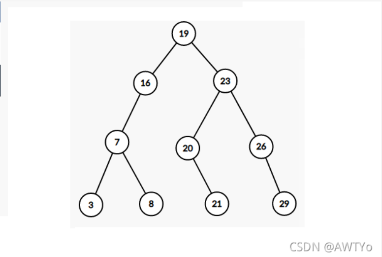
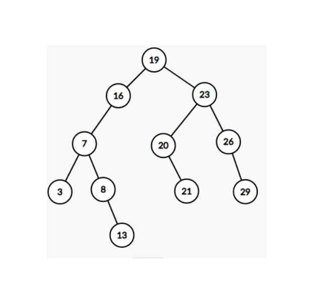
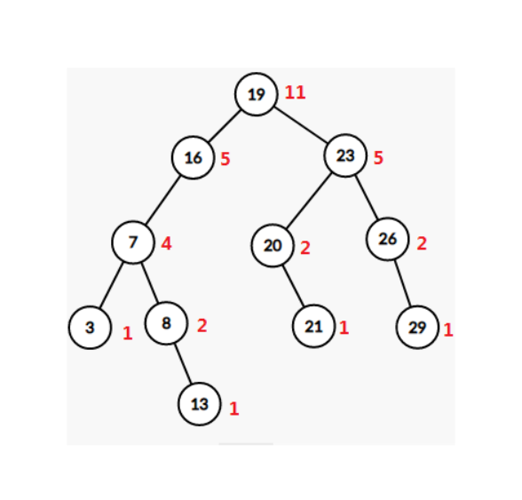
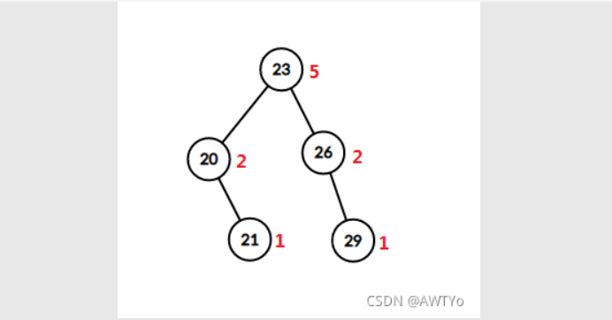

# 关于 BST
## 一、定义

&emsp; 我们来看这张图，我们很容易发现，这棵树是从左到右依次递增的，也就是对于所有的节点来说，它的右儿子一定大于它的左儿子。这棵树也就是一颗二叉查找树，顾名思义，这玩意儿就是拿来查找东西的。

&emsp; 想一下，如果我们用其他的算法比如排序来查找一个数列的第 k 大，那我们的最快的期望复杂度也就是 $O(n\log  n)$，而二叉查找树可以做到 $O(\log n)$ 查找。而且它不仅能用来查找第 k 大（按排名查值），还能按值查排名，还可以用来找前驱和后继。

-----
## 二、二叉查找树的一些操作
### 节点
&emsp; 首先我们要知道二叉查找树里的每个节点里面都存了一些什么东西，首先，和其他的 "树据结构" 一样，二叉查找树的每个节点要记录自己的两个儿子的编号。分别记为 ls 和 rs。除此之外，肯定还要记录一个这个节点存的值。

&emsp; 除了上面两个显然需要记录的，我们要有两个值，一个是 size 表示以当前节点为根的子树的大小，另一个 cnt 表示这个节点存的值在原序列里出现过几次。

```cpp
struct Tnode{
	int ls, rs;
	int val;
	int size;
	int cnt;
}t[4 * MAXN];
```

### 插入
&emsp; 首先我们看看如何在 BST 里插入一个数。以以下数列为例，先建好一颗 BST，如下图：
&emsp; 数列：$[3, 7, 29, 8, 19,16, 23, 20, 21, 26]$

&emsp; 我们现在要把一个数 13 插入这棵树里面。首先有一个指针从根节点开始向下，首先它指向根节点。然后比较根节点和要插入的数的大小，很显然 13 < 19，所以我们把指针移向根节点的左子树里面。

&emsp; 现在指针指向 16，然后再比较大小，13 < 16 所以指针移向左子树。指针现在指向 7，7  < 13，所以指针移向右子树。现在指针指向 8， 8 < 13 而且 8 没有右子树了，所以我们要插入的 13 就变成 8 的右子树，像这样：

&emsp; 当然还有一种情况就是我们要新插入的数在原序列中已经存在了，那我们就给每个节点再记一个数量标记，表示这个数在数列中出现了几次(就是 cnt)。

&emsp; 代码：
```cpp
void add(int node, int dat){
	t[node].size++;
	if(t[node].val == dat){
		t[node].cnt++; return;
	}
	if(dat < t[node].val){
		if(t[node].ls) add(t[node].ls, dat);
		else{
			t[++num].val = dat;
			t[num].size = 1;
			t[num].cnt = 1;
			t[node].ls = num;
		}
	}
	else{
		if(t[node].rs) add(t[node].rs, dat);
		else{
			t[++num].val = dat;
			t[num].size = 1;
			t[num].cnt = 1;
			t[node].rs = num;
		}
	}
}
```

### 查询
&emsp; 前面我们也说了，BST 能够查询的功能有很多，所以我们一个一个说。先说查询前驱和后继。
#### 找前驱
&emsp; 首先前驱的定义：x 的前驱是小于 x 的最大的数。所以前驱一定比 x 小，前驱就有可能在 x 的左子树或 x 的左祖先里。我们还是以上面那个序列为例，这次我们查找 15 的前驱。
&emsp; （把图放过来免得一直往前翻qwq）


&emsp; 首先，一个指针指向根节点，19 > 15，又因为 15 的前驱一定比 15 小，所以前驱在根节点的左子树里。指针移向左子树，现在指向 16，16 > 15，所以继续移向左子树。

&emsp; 现在指针指向 7，7 < 15，所以 7 应该是 15 的前驱的一个候选项（因为不能保证最大），所以我们弄个变量把 7 给存下来。但是为了确保 7 是最大的，所以我们找 7 的右子树。现在指针指向 8，8 < 15 且 8 > 7，所以我们更新一下 15 的前驱为 8。然后还是不能保证最大，所以找 8 的后子树。现在指针指向 13，13 < 15 且 13 > 8，所以前驱更新为 13。此时 13 已经没有右子树了，所以 15 的前驱就是 13。

&emsp; 总结一下，其实找前驱，就是从根节点开始，递归子树，如果当前节点大于你要找的数，就找他的左子树，反之找他的右子树，直到没有可以找的为止；

```cpp
int findPre(int node, int val, int ans){
	if(val <= t[node].val){
		if(!t[node].ls) return ans;
		else return findPre(t[node].ls, val, ans);
	}
	else{
		if(!t[node].rs){
			if(val > t[node].val) return t[node].val;
			else return ans;
		}
		if(t[node].cnt) return findPre(t[node].rs, val, t[node].val);
		else return findPre(t[node].rs, val, ans);
	}
}
```

#### 找后继
&emsp; 找后继同理（就是反了一下）：

```cpp
int findNxt(int node, int val, int ans){
	if(val >= t[node].val){
		if(!t[node].rs) return ans;
		else return findNxt(t[node].rs, val, ans);
	}
	else{
		if(!t[node].ls){
			if(val < t[node].val) return t[node].val;
			else return ans;
		}
		if(t[node].cnt) return findNxt(t[node].ls, val, t[node].val);
		else return findNxt(t[node].ls, val, ans);
	}
}
```

#### 按排名查值
&emsp; 因为我们知道对于一颗 BST 来说，左边的严格小于右边的，所以我们要找排名为 k 的数也就是第 k 靠左的节点中的数。这时候之前看起来没啥用的 size 就要上场了。我们再把上面那个数列的 BST 的图放下来，但是这次每个节点旁边有一个红色的数字，这个数字就是这个节点对应的 size 值：

&emsp; 我们以 k = 7 为例，即查询排名为 k 的值，来模拟一遍查询过程。还是一个指针指向根节点，首先我们发现根节点的左子树大小为 5，所以根节点本身加上它的左子树的大小为 6 < 7。所以我们直接不管左半边，而看右半边（如下图）。

&emsp; 又因为我们已经把左半边砍了，也就相当于砍掉了前 6。那么我们就是要在这右半部分找排名第一的数。现在指针指向 23 ，我们知道 23 的左子树大小为 2，2 > 1，所以第 1 在23 的左子树里，指针移向左子树。现在指针指向 20，又因为 20 没有左子树，所以答案就是 20。

&emsp; 由上面的例子可以得出，我们在按排名查值时，当前位置的排名为他左子树的大小加上自己 cnt（该节点有几个）的大小，如果当前排名小于要找的排名，就去右子树找，并更新要找的排名，反之先自查，不行再去左子树找

&emsp; 代码：
```cpp
#define INFI1 << 30

int findValByRank(int node, int rank){
	if(!node) return INFI;
	if(t[t[node].ls].size >= rank)
		return findValByRank(t[node].ls, rank);
	if(t[t[node].ls].size + t[node].cnt >= rank)
		return t[node].val;
	return findValByRank(t[node].rs, rank - t[t[node].ls].size - t[node].cnt);
}
```

#### 按值查排名
&emsp; 其实这个和按排名查值是差不多的，我们还是来模拟一下过程，以 20 为例。

&emsp; 首先，指针指向根节点，然后根节点 19 < 20，所以指针指向右子树，因为跳过了左子树包括根节点的前六名，所以排名加上6。现在指针指向 23 > 20 ，所以指针指向左子树，然后排名加 1,。现在指针指向 20 = 20。所以答案就是 6 + 1 = 7。

&emsp; 看代码：

```cpp
int findRankByVal(int node, int val){
	if(!node) return 0;
	if(val == t[node].val)
		return t[t[node].ls].size + 1;
	if(val < t[node].val)
		return findRankByVal(t[node].ls, val);
	return findRankByVal(t[node].rs, val) + t[t[node].ls].size + t[node].cnt;
}
```

## 三、一些注意事项
&emsp; 这个算法的优点有很多，但是有一个致命的缺点。就是说如果我们原有的数列是一个有序的数列的话，那么我们在建树（也就是一直 add()）的过程中，形成的就不是一棵树，而是一条链。这样的话树上操作的所有复杂度就会退化到线性 $O(n)$。

&emsp; 为了解决这个问题，我们就有了一些更优秀 ~~毒瘤~~ 的算法，叫做平衡二叉查找树。这一类算法有很多，比如：treap，splay，替罪羊树等等...
