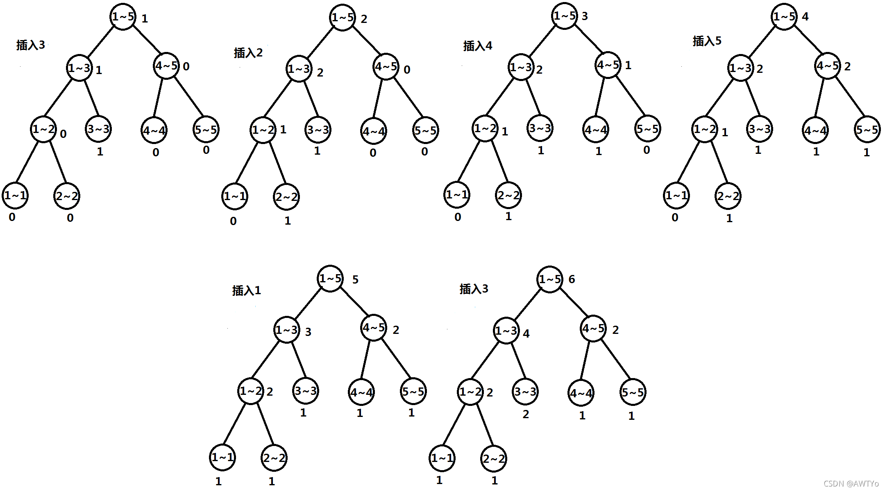

# 主席树
### 可持久化数据结构
&emsp; 首先，我们先了解一下什么是可持久化数据结构：
>可持久化数据结构 (Persistent data structure) 总是可以保留每一个历史版本，并且支持操作的不可变特性 (immutable)。
----

### 可持久化线段树
&emsp; 传送门：

&emsp; &emsp; [luoguP3919:可持久化线段树模板1](https://www.luogu.com.cn/problem/P3919) 

&emsp; &emsp; [luoguP3843:可持久化线段树模板2](https://www.luogu.com.cn/problem/P3834)

&emsp; 为什么要把可持久化线段树叫做主席树呢？那当然是因为它的发明者是 hjt 啦qwq。 发明者黄嘉泰 hjt 的拼音首字母与某位主席的名字一样哦qwq（ ~~当然我们也可以叫它黄金套qwq~~ ）

&emsp; 可持久化线段树主要就是解决上面两种问题，所以我们来看一下他是怎么解决的。

&emsp; 我们先看第一题。如题，如题，你需要维护这样的一个长度为 NN 的数组，支持如下几种操作

1. 在某个历史版本上修改某一个位置上的值

1. 访问某个历史版本上的某一位置的值

此外，每进行一次操作（对于操作2，即为生成一个完全一样的版本，不作任何改动），就会生成一个新的版本。版本编号即为当前操作的编号（从1开始编号，版本0表示初始状态数组）。首先，和普通线段树一样，我们先要建立一颗对于 a 数组的线段树（如下图）：


&emsp; 假设在时间 2 时我们修改了 a[4] 的值，则我们在正常的线段树中应该修改的节点就是 [4\~4]、[3\~4]、[1\~4]，这三个点。而我们在主席树中修改时，我们不能破坏掉修改之前的节点，所以我们copy[4\~4]、[3\~4]、[1\~4]这三个节点到另一个地方，并在这三份备份上进行修改工作，然后再让这三个点和原先没有被修改的点连起来，形成一颗新的线段树（如下图）：


&emsp; 如果在时间 3 的时候，我们要修改 a[2] 的值，那么我们就在第二次的线段树的基础上进行修改。同样的，复制[2\~2]、[1\~2]、[1\~4] 的备份，在备份上进行修改，同时将这三个点连接到原来的线段树上，形成下图所示：


&emsp; 以此类推......

&emsp; 而我们在进行查询工作的时候，只需要额外给定一个时间 t ，然后我们就从第 t 个根节点向下查询就好了。操作方法基本和普通线段树相同。

&emsp; 然而根据我们上面的建树过程来看，我们主席树的创建新节点，连边，节点编号，访问子节点，和存储根节点的方法都与普通线段树不同。于是我们来讨论一下如何存储这些东西。
1. 直接新开一块内存新的节点，编号数为节点总数 + 1。连边什么的一指了事。
2. 访问节点不是像普通线段树那样左儿子是 p << 1，右儿子是 p << 1 | 1。而是在结构体里存储自己点的编号。
3.  存储根节点就直接另开一个数组就好了.。

&emsp; 一个节点的结构体有三个变量：
```cpp
struct Tnode{
	int ls, rs;                               // 左右儿子
	int val;                                  // 权值
}t[MAXN];
```
&emsp; 复制节点：
```cpp
int cpy(int node){
	cnt++;
	t[cnt] = t[node];
	return cnt;
}
```
&emsp; 建树：
```cpp
int build(int node, int l, int r){
	node = ++cnt;
	if(l == r){
		t[node].val = a[l];
		return cnt;
	}
	int mid = (l + r) >> 1;
	t[node].ls = build(t[node].ls, l, mid);
	t[node].rs = build(t[node].rs, mid + 1, r);
	return node;
}
```
&emsp; 更新和线段树很像：
```cpp
int update(int node, int l, int r, int index, int val){
	node = cpy(node);
	if(l == r){
		t[node].val = val;
	}
	else{
		int mid = (l + r) >> 1;
		if(index <= mid)
			t[node].ls = update(t[node].ls, l, mid, index, val);
		else
			t[node].rs = update(t[node].rs, mid + 1, r, index, val);
	}
	return node;
}
```
&emsp; 询问也很像：
```cpp
int query(int node, int l, int r, int index){
	if(l == r){
		return t[node].val;
	}
	else{
		int mid = (l + r) >> 1;
		if(index <= mid)
			return query(t[node].ls, l, mid, index);
		else
			return query(t[node].rs, mid + 1, r, index);
	}
}
```
&emsp; AC代码：
```cpp
#include<bits/stdc++.h>
using namespace std;
#define in read()
#define MAXN 1000100
#define MAXM 1000100

int read(){
	int x = 0; char c = getchar();
	while(c < '0' or c > '9') c = getchar();
	while(c >= '0' and c <= '9'){
		x = x * 10 + c - '0';
		c = getchar();
	}
	return x;
}

int n = 0; int m = 0;
int a[MAXN] = { 0 };
int root[MAXM] = { 0 };

int cnt = 0;
struct Tnode{
	int ls, rs;
	int val;
}t[32 * MAXN];

int cpy(int node){
	cnt++;
	t[cnt] = t[node];
	return cnt;
}

int build(int node, int l, int r){
	node = ++cnt;
	if(l == r){
		t[node].val = a[l];
		return cnt;
	}
	int mid = (l + r) >> 1;
	t[node].ls = build(t[node].ls, l, mid);
	t[node].rs = build(t[node].rs, mid + 1, r);
	return node;
}

int update(int node, int l, int r, int index, int val){
	node = cpy(node);
	if(l == r){
		t[node].val = val;
	}
	else{
		int mid = (l + r) >> 1;
		if(index <= mid)
			t[node].ls = update(t[node].ls, l, mid, index, val);
		else
			t[node].rs = update(t[node].rs, mid + 1, r, index, val);
	}
	return node;
}

int query(int node, int l, int r, int index){
	if(l == r){
		return t[node].val;
	}
	else{
		int mid = (l + r) >> 1;
		if(index <= mid)
			return query(t[node].ls, l, mid, index);
		else
			return query(t[node].rs, mid + 1, r, index);
	}
}

int main(){
	scanf("%d%d", &n, &m);
	for(int i = 1; i <= n; i++){
		scanf("%d" , &a[i]);
	}
	
	root[0] = build(1, 1, n);
	
	for(int i = 1; i <= m; i++){
		int v = 0, op = 0, loc = 0;
		scanf("%d%d%d", &v, &op, &loc);
		if(op == 1){
			int val = 0;
			scanf("%d", &val);
			root[i] = update(root[v], 1, n, loc, val);
		} 
		else if(op == 2){
			printf("%d\n", query(root[v], 1, n, loc));
			root[i] = root[v];
		}
	}
	
	return 0;
}
```
&emsp; 然后是第二道题，如题，给定 nn 个整数构成的序列 aa，将对于指定的闭区间 [l, r] 查询其区间内的第 k 小值。在说这道题之前，我们先来看一下权值线段树。

&emsp; 权值线段树和普通线段树样子类似，但是存储的东西不同，权值线段树的每个节点对应的区间下标而是数值范围，他的意思是在整个数组中有多少个数字属于 [l, r]。比如说我们依次插入 {3, 2, 4, 5, 1, 3} 所形成的权值线段树如下图。



&emsp; 我们会发现，这几颗线段树是可减的，什么意思呢，就是说我们用第4棵树减去第一棵树，我们就得到了一棵新的树，这棵树维护的就是第2个数到第4个数{2， 4， 5}的权值线段树了。（其实就是前缀的思想）

&emsp; 现在我们知道，对于任意一个 [l, r] 区间的权值线段树都可以用两颗权值线段树直接相减所获得。但是如果直接维护 n 棵线段树需要的空间太大了，所以我们考虑前面讲的主席树的方法来存储这 n 棵线段树。然后就可以查询了，如果我们要查询 [i, j] 区间的第 k
小数，就先用以 root[j] 为根的线段树减去以 root[i-1] 为根的线段树就获得了在区间 [i, j] 上的线段树。然后再这棵线段树上进行查询。

&emsp; 在查询到过程中，我们分别从 root[j] 和 root[j-1] 开始，若 l == r，则返回 l。将当前两个节点的左子树的权值相减，记为s。s 就表示当前节点的区间的前一半的数的个数。如果 $k \leq s$ 那就在左子树中查找，如果 s 比 k 小那么就在右子树中查找第 k - s 小的数。

&emsp; AC 代码如下：

```cpp
#include<bits/stdc++.h>
using namespace std;

const int MAXN = 200010;
int n, q, m, cnt = 0;
int a[MAXN], b[MAXN], T[MAXN];
int sum[MAXN << 5], L[MAXN << 5], R[MAXN << 5];

inline int build(int l, int r){
    int rt = ++ cnt;
    sum[rt] = 0;
    if (l < r){
        int mid = (l + r) >> 1;
        L[rt] = build(l, mid);
        R[rt] = build(mid + 1, r);
    }
    return rt;
}

inline int update(int pre, int l, int r, int x){
    int rt = ++ cnt;
    L[rt] = L[pre]; R[rt] = R[pre]; sum[rt] = sum[pre] + 1;
    if (l < r){
        int mid = (l + r) >> 1;
        if (x <= mid) L[rt] = update(L[pre], l, mid, x);
        else R[rt] = update(R[pre], mid + 1, r, x);
    }
    return rt;
}

inline int query(int u, int v, int l, int r, int k){
    if (l >= r) return l;
    int mid = (l + r) >> 1;
    int s = sum[L[v]] - sum[L[u]];
    if (s >= k) return query(L[u], L[v], l, mid, k);
    else return query(R[u], R[v], mid + 1, r, k - s);
}

int main(){
    scanf("%d%d", &n, &q);
    for (int i = 1; i <= n; i++){
        scanf("%d", &a[i]);
        b[i] = a[i];
    }
    
    sort(b+1, b+1+n);
    m = unique(b + 1, b + n + 1) - b - 1;
    
    T[0] = build(1, m);
    
    for (int i = 1; i <= n; i ++){
        int t = lower_bound(b + 1, b + m + 1, a[i]) - b;
        T[i] = update(T[i - 1], 1, m, t);
    }
    
    while(q--){
        int x, y, z;
        scanf("%d%d%d", &x, &y, &z);
        int t = query(T[x - 1], T[y], 1, m, z);
        printf("%d\n", b[t]);
    }
    return 0;
}
```
