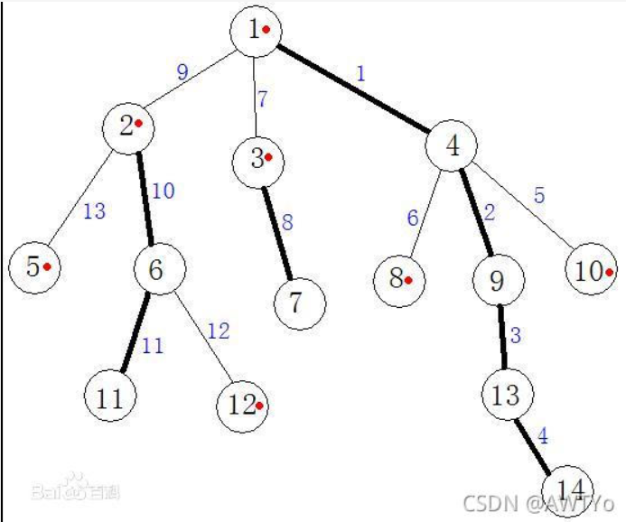

# 树链剖分
## 两个问题：
&emsp; 首先，我们来看看两个经典的问题：

1. 在树上的两个点的最短路径上的所有点的值加上 c。
2. 求出树上任意两点的最短距离。

&emsp; 第一个问题，很明显就是一个树上差分的模板题，只需要对于每次修改弄一个差分，查询的时候从下向上做一遍 dfs 求一遍前缀和就行了。而对于第二个问题很显然是 LCA 的模板题，先预处理出 dis 数组表示一个我们选定出的根节点到任意点的距离，然后任意两点之间的距离就是 dis[x] + dis[y] - 2 * dis[LCA(x, y)]。

&emsp; 但是，如果我们把这两个问题结合起来形成一道新的题，也就是会对于每次修改都有可能有一次查询。如果按照我们上面的两个算法来解决的话，那么时间复杂度就不够优秀了，因为对于每一次修改我们都需要改变一次 dis 数组。所以我们就需要树链剖分登场了。

## 介绍
&emsp; 树链剖分的基本思想就是将整棵树拆成多条链，然后利用其他数据结构来维护这些链，本质上其实是一种暴力，只不过进行了一点点优化。树链剖分常用来处理这样的问题：

1. 将树上 x 到 y 的最短路径上的所有节点的值加上 z。
2. 求树上 x 到 y 的最短路径上所有节点的权值和。
3. 将以 x 为根的子树内的所有节点的值加上 z。
4. 求以 x 为根的子树内所有节点的权值和。

&emsp; 模板传送门：[luogu P3384 [模板] 树链剖分](https://www.luogu.com.cn/problem/P3384)

## 几个概念
1. **重儿子**：对于一个非叶子节点，它的所有儿子中，以它的儿子为根的子树大小最大的儿子叫做这个节点的重儿子。如果最大的有多个，那么随便选一个作为这个重儿子。一个节点的重儿子有且仅有一个。
2. **轻儿子**：重儿子以外的其他儿子（叶子结点没有重儿子也没有轻儿子 ~~它们本来就没有儿子~~）。
3. **重边**：一个父亲连接它的重儿子的边叫做重边。
4. **轻边**：除了重边的其他边。
5. **重链**：重边们所形成的的路径叫做重链。


&emsp; 如图，标成红点的就是重儿子，加粗的就是重边，加粗的边连成的路径就是重链。

## 预处理一些信息
&emsp; 因为有这些神奇的概念，我们就需要一些数组们来存储这些神奇的的东西。比如说我们需要：

1. dep[] 记录每个店的深度
2. fa[] 记录每个店的父亲
3. size[] 记录每个点的子树大小
4. son[] 记录每个非叶子节点的重儿子编号
5. top[] 记录当前节点所在的链的顶端节点，特别的，轻链上的点的 top 为它本身
6. idx[] 记录树中每个节点剖分之后的新编号（dfs 序）
7. nv[] 记录 dfs 序对应回来的点的标号的值

&emsp; 这些信息我们可以用两个 dfs 来预处理出来。首先第一个 dfs 处理 dep，fa，size 和 son：
```cpp
int  dep[MAXN] = { 0 };
int   fa[MAXN] = { 0 };
int size[MAXN] = { 0 };
int  son[MAXN] = { 0 };
void dfs1(int x, int father, int depth){
	dep[x] = depth; fa[x] = father; size[x] = 1;
	for(int e = first[x]; e;e = nxt[e]){
		int y = to[e];
		if(y != father){
			dfs1(y, x, depth + 1);
			size[x] += size[y];
			if(size[y] > size[son[x]]) son[x] = y;
		}
	}
}
```

&emsp; 然后是第二个 dfs 处理 top，idx和 nw（我们保证一条重链上的点的 dfs 序是连续的）。
```cpp
int cnt = 0;
int top[MAXN] = { 0 };
int idx[MAXN] = { 0 };
int  nv[MAXN] = { 0 };
void dfs2(int x, int t){
	top[x] = t; idx[x] = ++cnt; nv[cnt] = value[x];
	if(!son[x]) return;
	dfs2(son[x], t);
	for(int e = first[x]; e; e = nxt[e]){
		int y = to[e];
		if(y != fa[x] and y != son[x]) dfs2(y, y);
	}
}
```

## 处理
&emsp; 现在才到重头戏。刚才我们已经利用两遍 dfs 将树剖成了很多条链，那我们来看看现在该怎么处理我们刚才的那四个操作。先来回顾一下操作是什么：

1. 将树上 x 到 y 的最短路径上的所有节点的值加上 z。
2. 求树上 x 到 y 的最短路径上所有节点的权值和。
3. 将以 x 为根的子树内的所有节点的值加上 z。
4. 求以 x 为根的子树内所有节点的权值和。

### 处理路径
&emsp; 很显然，我们可以将这四个操作分成两类，第一类是对于树上任意两点的路径的操作，第二类树对于一个点和它的子树的操作。我们来分类讨论一下。

&emsp; 首先我们说树上任意两点路径的处理：首先我们有两个点 x 和 y，我们假设 x 的深度更深，那么我们考虑这样操作（以查询路径上所有点权值和为例）：

1. 首先答案加上 x 到 x 所在的链的顶端的区间和。
2. 把 x 跳到 x 所在的链的顶端的上面的一个点。

&emsp; 然后不停重复这两个操作，知道两个点在同一条链上，再加上这两个点之间的区间和就好了。根据上面我们说的，我们就想到需要对每一条链来维护一个区间和，那就可以用线段树来维护（因为我们前面保证了一条链上的节点的 dfs 序是连续的，所以可以这样处理）。

&emsp; 线段树代码：
```cpp
struct Tnode{
	int l, r;
	int dat;
	int lazy;
}t[MAXN * 4];

inline void pushup(int p){
	t[p].dat = t[ls(p)].dat + t[rs(p)].dat;
}
inline void pushdown(int p){
	if(t[p].lazy){
		t[ls(p)].lazy = (t[ls(p)].lazy + t[p].lazy) % MOD;
		t[rs(p)].lazy = (t[rs(p)].lazy + t[p].lazy) % MOD;
		t[ls(p)].dat = (t[ls(p)].dat + 1ll * t[p].lazy * (t[ls(p)].r - t[ls(p)].l + 1)) % MOD;
		t[rs(p)].dat = (t[rs(p)].dat + 1ll * t[p].lazy * (t[rs(p)].r - t[rs(p)].l + 1)) % MOD;
		t[p].lazy = 0;
	}
}

void build(int p, int l, int r){
	t[p].l = l; t[p].r = r;
	if(l == r){
		t[p].dat = nv[l]; return;
	}
	int mid = (l + r) >> 1;
	build(ls(p), l, mid);
	build(rs(p), mid + 1, r);
	pushup(p);
}

void update(int p, int l, int r, int val){
	if(l <= t[p].l and t[p].r <= r){
		t[p].dat += val * (t[p].r - t[p].l + 1);
		t[p].lazy += val; return;
	}
	pushdown(p);
	int mid = (t[p].l + t[p].r) >> 1;
	if(l <= mid) update(ls(p), l, r, val);
	if(r > mid)  update(rs(p), l, r, val);
	pushup(p);
}

int query(int p, int l, int r){
	if(l <= t[p].l and t[p].r <= r) return t[p].dat;
	pushdown(p);
	int mid = (t[p].l + t[p].r) >> 1; int ans = 0;
	if(l <= mid) ans += query(ls(p), l, r);
	if(r > mid)  ans += query(rs(p), l, r);
	return ans % MOD;
}
```

&emsp; 查询任意两点路径上的点的权值和：
```cpp
int sumRange(int x, int y){
	int ans = 0; int fx = top[x]; int fy = top[y];
	while(fx != fy){
		if(dep[fx] >= dep[fy]){
			ans = (ans + query(1, idx[fx], idx[x])) % MOD;
			x = fa[fx]; fx = top[x];
		}
		else{
			ans = (ans + query(1, idx[fy], idx[y])) % MOD;
			y = fa[fy]; fy = top[y];
		}
	}
	if(idx[x] <= idx[y]) ans += query(1, idx[x], idx[y]);
	else ans += query(1, idx[y], idx[x]);
	return ans % MOD;
}
```

&emsp; 修改任意两点的路径上的点的所有权值：
```cpp
void modifyRange(int x, int y, int k){
	k %= MOD; int fx = top[x]; int fy = top[y];
	while(fx != fy){
		if(dep[fx] >= dep[fy]){
			update(1, idx[fx], idx[x], k);
			x = fa[fx]; fx = top[x];
		}
		else{
			update(1, idx[fy], idx[y], k);
			y = fa[fy]; fy = top[y];
		}
	}
	if(idx[x] <= idx[y]) update(1, idx[x], idx[y], k);
	else update(1, idx[y], idx[x], k);
}
```

### 处理子树
&emsp; 接下来就是另一种操作，处理一个节点的子树上的所有节点。我们还是以求和为例。因为我们在 dfs 的时候是从上面往下编号的，所以一棵子树里面的所有节点的编号肯定是连续的，所以我们也可以直接用线段树求区间和。

```cpp
int sumSon(int x){
	return query(1, idx[x], idx[x] + size[x] - 1) % MOD;
}
```

&emsp; 修改子树：
```cpp
void modifySon(int x, int k){
	k %= MOD;
	update(1, idx[x], idx[x] + size[x] - 1, k);
}
```

## 完整代码
```cpp
#include<bits/stdc++.h>
using namespace std;
#define in read()
#define MAXN 100100
#define MAXM 2 * MAXN
#define ls(p) (p << 1)
#define rs(p) (p << 1 | 1)
#define MOD mod
#define endl '\n'

inline int read(){
	int x = 0; char c = getchar();
	while(c < '0' or c > '9') c = getchar();
	while('0' <= c and c <= '9'){
		x = x * 10 + c - '0'; c = getchar();
	}
	return x;
}

int n = 0; int m = 0;
int r = 0; int mod = 0;

int tot = 0;
int first[MAXN] = { 0 };
int   nxt[MAXM] = { 0 };
int    to[MAXM] = { 0 };
int value[MAXN] = { 0 };

inline void add(int x, int y){
	nxt[++tot] = first[x];
	first[x] = tot; to[tot] = y;
}

int  dep[MAXN] = { 0 };
int   fa[MAXN] = { 0 };
int size[MAXN] = { 0 };
int  son[MAXN] = { 0 };
void dfs1(int x, int father, int depth){
	dep[x] = depth; fa[x] = father; size[x] = 1;
	for(int e = first[x]; e;e = nxt[e]){
		int y = to[e];
		if(y != father){
			dfs1(y, x, depth + 1);
			size[x] += size[y];
			if(size[y] > size[son[x]]) son[x] = y;
		}
	}
}

int cnt = 0;
int top[MAXN] = { 0 };
int idx[MAXN] = { 0 };
int  nv[MAXN] = { 0 };
void dfs2(int x, int t){
	top[x] = t; idx[x] = ++cnt; nv[cnt] = value[x];
	if(!son[x]) return;
	dfs2(son[x], t);
	for(int e = first[x]; e; e = nxt[e]){
		int y = to[e];
		if(y != fa[x] and y != son[x]) dfs2(y, y);
	}
}

struct Tnode{
	int l, r;
	int dat;
	int lazy;
}t[MAXN * 4];

inline void pushup(int p){
	t[p].dat = t[ls(p)].dat + t[rs(p)].dat;
}
inline void pushdown(int p){
	if(t[p].lazy){
		t[ls(p)].lazy = (t[ls(p)].lazy + t[p].lazy) % MOD;
		t[rs(p)].lazy = (t[rs(p)].lazy + t[p].lazy) % MOD;
		t[ls(p)].dat = (t[ls(p)].dat + 1ll * t[p].lazy * (t[ls(p)].r - t[ls(p)].l + 1)) % MOD;
		t[rs(p)].dat = (t[rs(p)].dat + 1ll * t[p].lazy * (t[rs(p)].r - t[rs(p)].l + 1)) % MOD;
		t[p].lazy = 0;
	}
}

void build(int p, int l, int r){
	t[p].l = l; t[p].r = r;
	if(l == r){
		t[p].dat = nv[l]; return;
	}
	int mid = (l + r) >> 1;
	build(ls(p), l, mid);
	build(rs(p), mid + 1, r);
	pushup(p);
}

void update(int p, int l, int r, int val){
	if(l <= t[p].l and t[p].r <= r){
		t[p].dat += val * (t[p].r - t[p].l + 1);
		t[p].lazy += val; return;
	}
	pushdown(p);
	int mid = (t[p].l + t[p].r) >> 1;
	if(l <= mid) update(ls(p), l, r, val);
	if(r > mid)  update(rs(p), l, r, val);
	pushup(p);
}

int query(int p, int l, int r){
	if(l <= t[p].l and t[p].r <= r) return t[p].dat;
	pushdown(p);
	int mid = (t[p].l + t[p].r) >> 1; int ans = 0;
	if(l <= mid) ans += query(ls(p), l, r);
	if(r > mid)  ans += query(rs(p), l, r);
	return ans % MOD;
}

int sumRange(int x, int y){
	int ans = 0; int fx = top[x]; int fy = top[y];
	while(fx != fy){
		if(dep[fx] >= dep[fy]){
			ans = (ans + query(1, idx[fx], idx[x])) % MOD;
			x = fa[fx]; fx = top[x];
		}
		else{
			ans = (ans + query(1, idx[fy], idx[y])) % MOD;
			y = fa[fy]; fy = top[y];
		}
	}
	if(idx[x] <= idx[y]) ans += query(1, idx[x], idx[y]);
	else ans += query(1, idx[y], idx[x]);
	return ans % MOD;
}

void modifyRange(int x, int y, int k){
	k %= MOD; int fx = top[x]; int fy = top[y];
	while(fx != fy){
		if(dep[fx] >= dep[fy]){
			update(1, idx[fx], idx[x], k);
			x = fa[fx]; fx = top[x];
		}
		else{
			update(1, idx[fy], idx[y], k);
			y = fa[fy]; fy = top[y];
		}
	}
	if(idx[x] <= idx[y]) update(1, idx[x], idx[y], k);
	else update(1, idx[y], idx[x], k);
}

int sumSon(int x){
	return query(1, idx[x], idx[x] + size[x] - 1) % MOD;
}

void modifySon(int x, int k){
	k %= MOD;
	update(1, idx[x], idx[x] + size[x] - 1, k);
}

int main(){
	n = in; m = in; r = in; mod = in;
	for(int i = 1; i <= n; i++) value[i] = in;
	for(int i = 1; i < n; i++){
		int x = in; int y = in;
		add(x, y); add(y, x);
	}
	dfs1(r, 0, 1); dfs2(r, r); build(1, 1, n);
	for(int i = 1; i <= m; i++){
		 int op = in;
		 if(op == 1){
		 	int x = in; int y = in; int k = in;
		 	modifyRange(x, y, k);
		 }
		 else if(op == 2){
		 	int x = in; int y = in;
		 	cout << sumRange(x, y) << endl;
		 }
		 else if(op == 3){
		 	int x = in; int k = in;
		 	modifySon(x, k);
		 }
		 else{
		 	 int x = in;
		 	 cout << sumSon(x) << endl;
		 }
	}
	return 0;
}
```
