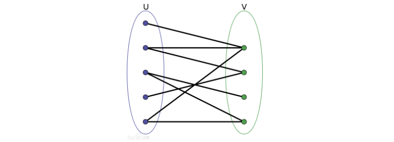

# 关于二分图

## 二分图的定义（来自百度）

>​
二分图又称作二部图，是图论中的一种特殊模型。 设G=(V,E)是一个无向图，如果顶点V可分割为两个互不相交的子集(A,B)，并且图中的每条边（i，j）所关联的两个顶点i和j分别属于这两个不同的顶点集(i in A,j in B)，则称图G为一个二分图。

&emsp; 按照正常的人能听懂的方式说， 就是有这样一张图，它的节点可以被分为两组（为了方便，在后文中我们分别称这两组节点为X集和Y集），每组中的任意两个节点之间没有边。就是说一个二分图的所有边连接的都是分居两组的两个节点。就比如说下面这张图就是一个二分图：



-----

## 二分图判定----染色法

&emsp;  大致就是说对于图中的所有点，给他们染色，如果整个图能被全部染成两个颜色（也就是分为两组）就说明这个图是一个二分图。让色的方法就是便利一个节点 u 连出去的所有点 v，并把 v 染色成于 u 相反的颜色。（其实就是一个 dfs）。代码如下：

```c++
#include<bits/stdc++.h>
using namespace std;

#define MAXN 100100
#define MAXM 2 * MAXN

int n = 0; int m = 0;

int tot = 0;
int first[MAXN] = { 0 };
int   nxt[MAXM] = { 0 };
int    to[MAXM] = { 0 };

void add(int x, int y){                             // 邻接表 没什么好说的 
	nxt[++tot] = first[x];
	first[x] = tot; to[tot] = y;
}

int color[MAXN] = { 0 };

bool dfs(int x, int c){                             // 尝试把节点 x 染成 c 并返回是否染色成功 
	color[x] = c;                                   // 染色
	for(int e = first[x]; e; e = nxt[e]){
		int y = to[e];
		if(color[y] == c){
			return false;                           // 连出去的点和自身的颜色相同 染色失败 
		}
		if(color[y] == 0 and !dfs(y, -c)){
			return false;                           // 如果相邻的节点没有被染色 但是给他染上和自己相反的颜色却失败了 则染色失败 
		}
	} 
	return true;                                    // 染色成功  
}

int main(){
	scanf("%d%d", &n, &m);
	for(int i = 1; i <= m; i++){
		int x = 0; int y = 0;
		scanf("%d%d", &x, &y);
		add(x, y);
		add(y, x);
	}
	
	for(int i = 1; i <= n; i++){
		if(color[i] == 0){                          // 如果没被染色      
			if(!dfs(i, 1)){
				printf("NO\n");                     // 染色不成功 说明不是二分图 
				return 0;
			} 
		}
	}
	printf("YES\n");                                // 所有点都染色成功 说明是二分图 
	return 0;
}
```

-------

## 二分图的最大匹配----匈牙利算法

&emsp;  首先我们要知道最大匹配是个什么东西。（以下来自与百度）

>​
给定一个二分图G，在G的一个子图M中，M的边集{E}中的任意两条边都不依附于同一个顶点，则称M是一个匹配

极大匹配(Maximal Matching)是指在当前已完成的匹配下,无法再通过增加未完成匹配的边的方式来增加匹配的边数。

最大匹配(maximum matching)是所有极大匹配当中边数最大的一个匹配。选择这样的边数最大的子集称为图的最大匹配问题。

&emsp; 简单来说就是二分图中我们能一一配对的节点的最大对数。 

&emsp; 接下来我们就要来介绍**匈牙利算法**（**也称增广路算法**）（以下来自百度）

>​
**匈牙利算法**是一种在多项式时间内求解任务分配问题的组合优化算法，并推动了后来的原始对偶方法。美国数学家哈罗德·库恩于1965年提出该算法。此算法之所以被称作匈牙利算法，是因为算法很大一部分是基于以前匈牙利数学家Dénes Kőnig和Jenő Egerváry的工作之上创建起来的。

​&emsp; 简而言之，这个算法就是用来求解二分图最大匹配的算法（~~网络流也行但是本蒟蒻写不来网络流qwq~~）。而它的时间复杂度是O(MN)。还是比较友好的。

&emsp; 匈牙利算法本身主要是一个基于贪心思想的算法，它的主要过程如下：

1. 几个要用到的重要数组： 

&emsp; &emsp; 1):edge[MAXN][MAXN]： 邻接矩阵（应该不用解释）

&emsp; &emsp; 2):match[MAXN] ：Y集内的定点被哪些 X 集中的定点**匹配**了，就是 Y 集中定点被**匹配**的状态。match[i] = x --> Y 集中的点 i **匹配**给了 X 集中的点 x。

&emsp; &emsp; 3):used[MAXN]：在每一轮 X 集中的定点准备与 Y 集的点配对的时候用来标记 Y 集中**这一轮中**不能被其他 X 中的点**选择**的点。因为保存到每一轮选择的标记所以每次开始新的一轮选择的时候要清空uesd 数组。

2. 对于每一个 X 集中的定点 x 来说，我们都要给它来一轮匹配。匹配的具体步骤如下：

&emsp; &emsp; 1):枚举所有 Y 集中的点y，如果这个点 y 和 x 有边相连且点 y 还没有被选择。我们就进入下一步的处理

&emsp; &emsp; 2):标记这个点 y 已经被**选择**过，然后判断这个点 y 是否**匹配**过，或者与这个 y **匹配**的点 x' 还有其他能够**匹配**的点 y'。如果满足上述条件则进入下一步。

&emsp; &emsp; 3):标记这个点 y 已经被**匹配**，并返回匹配成功。

3. 对于每个 x 若匹配成功，则总的匹配数加一。当所有的点都匹配完毕时，我们就得到了二分图的最大匹配。


&emsp; 代码如下：

```c++
#include<bits/stdc++.h>
using namespace std;

#define MAXN 10010

/* 匈牙利算法 二分图最大匹配 */

int k = 0;                                  // 总边数 
int n = 0; int m = 0;                       // n为 X 集中的节点数 m 为 Y 集中度节点数 

int edge[MAXN][MAXN] = { 0 };
int  used[MAXN] = { 0 };
int match[MAXN] = { 0 };

bool dfs(int x){
	for(int i = 1; i <= m; i++){
		if(edge[x][i] and !used[i]){              // 如果有边且没有被选择过 
			used[i] = 1;                          // 标记被选择过 
			if(!match[i] or dfs(match[i])){       // 如果没有被匹配过 或者 匹配他的还有能够匹配到的 
				match[i] = x;                     // 标记被 x 匹配了
				return 1;                         // 匹配成功 
			}
		}
	}
	return 0;                                     // 匹配失败 
}

int main(){
	scanf("%d", &k);
	scanf("%d%d", &n, &m);
	for(int i = 1; i <= k; i++){
		int x = 0; int y = 0;
		scanf("%d%d", &x, &y);
		edge[x][y] = 1;                     // x 到 y 有一条边 x -> y
	}
	
	int sum = 0;                            // 最大匹配
	for(int i = 1; i <= n; i++){
		memset(used, 0, sizeof(used));      // 每一轮清空 used 数组
		if(dfs(i)){
			sum++;
		} 
	} 
	
	printf("%d\n", sum);
	return 0;
}
```