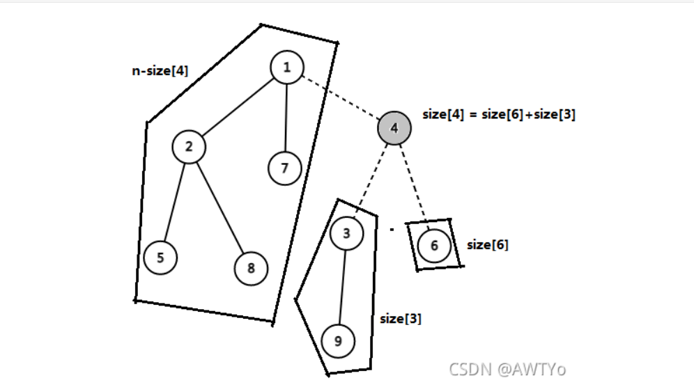

# 关于树的重心

## 一、定义

> 对于树上的每一个点，计算其所有子树中最大的子树节点数，这个值最小的点就是这棵树的重心。
>（这里以及下文中的“子树”都是指无根树的子树，即包括“向上”的那棵子树，并且不包括整棵树自身。）

&emsp; ​
以上内容摘自 [树的重心 OI Wiki](https://oi-wiki.org/graph/tree-centroid/)

&emsp; ​
我们要求得一棵树的重心，我们就需要一个 $size[MAXN]$ 数组。而这个数组的值需要从叶子结点往上来进行统计。对于叶子结点，我们知道 "以它为根的子树的大小是1" ，而对于非叶子节点 $x$ 来说，$x$ 有 $k$ 个子节点 $y_1 ~ y_k$，并且以$y_1 ~ y_k$为根的子树的大小分别为 $size[y_1]$，$size[y_2]$，$\cdots$，$size[y_k]$。则$size[x] =  size[1] + size[2] +\cdots+ size[k] +1$。如下图：



&emsp; 通过下面的代码，我们可以求出 size 数组，并求出树的重心。

```c++
#include<bits/stdc++.h>
using namespace std;

#define INFI 1 << 20
#define MAXN 100100
#define MAXM 2 * MAXN

int n = 0; int m = 0;

int tot = 0;
int first[MAXN] = { 0 };
int   nxt[MAXM] = { 0 };
int    to[MAXM] = { 0 };

void add(int x, int y){
	nxt[++tot] = first[x];
	first[x] = tot; to[tot] = y;
} 

bool vis[MAXN] = { 0 };
int size[MAXN] = { 0 };
int ans = INFI; int pos = 0;

void dfs(int x){
	vis[x] = 1;                                   // x 被访问过 
	size[x] = 1;                                  // 子树 x 的大小
	int max_part = 0;                             // 删除 x 后成分的最大子树大小
	for(int e = first[x]; e; e = nxt[e]){
		int y =to[e];
		if(vis[y]){
			continue;
		}
		dfs(y);
		size[x] += size[y];                       // 从子节点向父节点递推
		max_part = max(max_part, size[y]); 
	} 
	max_part = max(n - size[x], max_part);        // n 为整棵树的节点数量
	if(max_part < ans){
		ans = max_part;                           // ans 记录重心对应点 max_part的值 
		pos = x;                                  // pos 记录重心 
	} 
}

int main(){
	scanf("%d%d", &n, &m);
	for(int i = 1; i <= m; i++){
		int x = 0; int y = 0;
		scanf("%d%d", &x, &y);
		add(x, y);
	}
	
	dfs(1);
	
	printf("pos = %d ans = %d\n", pos, ans);
	 
	return 0;
}
```​