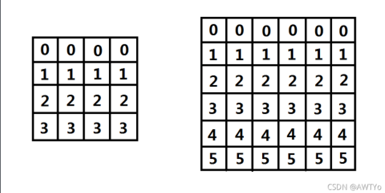
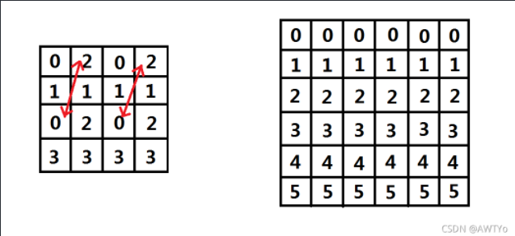
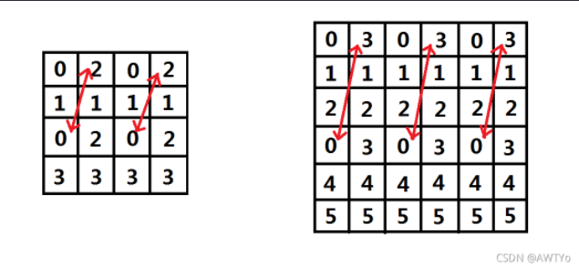
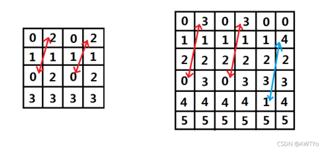
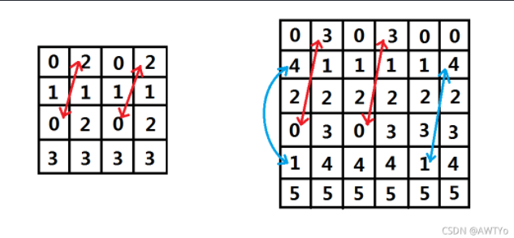

&emsp; %%%%% FSYo Orz orz orz
## F
&emsp; 没想到 T1 数据这么水，一个 bfs 就能炸出 70 分：
```cpp
#include<bits/stdc++.h>
using namespace std;
#define in read()
#define MAXN 202
#define MAXM 202
#define endl '\n'

inline int read(){
	int x = 0; char c = getchar();
	while(c < '0' or c > '9') c = getchar();
	while('0' <= c and c <= '9'){
		x = x * 10 + c - '0'; c = getchar();
	}
	return x;
}

int n = 0; int m = 0;

int tot = 0;
int first[MAXN] = { 0 };
int   nxt[MAXM] = { 0 };
int    to[MAXM] = { 0 };
int value[MAXM] = { 0 };
int  cost[MAXM] = { 0 };

inline void add(int x, int y, int c){
	nxt[++tot] = first[x];
	first[x] = tot;
	to[tot] = y; cost[tot] = c;
}

struct Tnode{
	int idx;
	int depth;
};
queue<Tnode> q;
int bfs(){
	q.push((Tnode){1, 0});
	while(!q.empty()){
		Tnode t = q.front(); q.pop();
		for(int e = first[t.idx]; e; e = nxt[e])
			if(t.depth >= cost[e]){
				int y = to[e];
				q.push((Tnode){y, t.depth + 1});
				if(y == n) return t.depth + 1;
			}
	}
}

int main(){
	freopen("f.in", "r", stdin);
	freopen("f.out", "w", stdout);
	n = in; m = in;
	for(int i = 1; i <= m; i++){
		int x = in; int y = in;
		int c = in; add(x, y, c);
	}
	cout << bfs() << endl;
	return 0;
}
```
&emsp; 更没想到，正解竟然是矩阵乘法....

&emsp; 首先，我们把所有的边按照 d 排一个序，然后根据所有边的 d 把总时间划分成若干段，每一段之间有一个 $\Delta d = d_{l+1} - d_l$（这个 $\Delta d$ 可能很大）。然后我们发现，对于每一段时间内，我们如果维护一个当前时间的 0/1 邻接矩阵 (dis)，这个邻接矩阵在每一段时间内是不变的，如果我们再维护一个 0/1 向量表示当前时间我们可能到达的点的集合(g)，那么下一个时间的 g 就是：$g' = g \times dis$（矩阵乘法），又因为一段时间内的 dis 不变，所以我们就可以用矩阵快速幂来求导这段时间结尾的 g（因为是 0/1 矩阵和 0/1 向量，所以我们可以直接用 bitset 存储并用 bitset 的或操作直接来进行矩阵乘法）。
$$ g_{end} = g_{start} \times dis^k $$

&emsp; 然后我们每一次处理完每一段时间之后就先把刚才处理的时间段的边加进图里，再对这张图进行一次 bfs，找到到 n 的最短路径来更新 ans 就好了。
```cpp
#include<bits/stdc++.h>
using namespace std;
#define in read()
#define MAXN 202
#define INFI 0x3f3f3f3f

inline int read(){
	int x = 0; int f = 1;
	char c = getchar();
	while(c < '0' or c > '9'){
		if(c == '-') f = -1;
		c = getchar();
	}
	while('0' <= c and c <= '9'){
		x = x * 10 + c - '0';
		c = getchar();
	}
	return x * f;
}

int n = 0; int m = 0;
bitset<MAXN> dis[32][MAXN];

int tot = 0;
int first[MAXN] = { 0 };
int   nxt[MAXN] = { 0 };
int    to[MAXN] = { 0 };
inline void add(int x, int y){
	nxt[++tot] = first[x];
	first[x] = tot; to[tot] = y;
}

int ans = INFI;
int d[MAXN] = { 0 };
int bfs(int node){
	memset(d, 0x3f, sizeof(d));
	d[node] = 0;
	queue<int> q; q.push(node);
	while(!q.empty()){
		int x = q.front(); q.pop();
		for(int e = first[x]; e; e = nxt[e]){
			int y = to[e];
			if(d[y] > d[x]){
				d[y] = d[x] + 1; q.push(y);
			}
		}
	}
	return d[n];
}

int l = 0;
struct Tnode{
	int s, t, d;
}a[MAXN];
inline bool comp(Tnode x, Tnode y){
	return x.d < y.d;
}

void work(int up){                                        // 快速幂
	for(int k = 0; k <= 30; k++)
		for(int i = 1; i <= n; i++) dis[k][i].reset();
	for(int i = 1; i <= l; i++) dis[0][a[i].s][a[i].t] = 1;
	for(int k = 1; k <= up; k++){
		for(int i = 1; i <= n; i++){
			if(!dis[k-1][i].count()) continue;
			for(int j = 1; j <= n; j++){
				if(dis[k-1][j][i]) dis[k][j] |= dis[k-1][i];
			}
		}
	}
}

bitset<MAXN> g;
bitset<MAXN> temp;

int main(){
	n = in; m = in;
	for(int i = 1; i <= m; i++){
		a[i].s = in; a[i].t = in; a[i].d = in;
	} sort(a + 1, a + m + 1, comp);
	if(n == 1) { puts("0"); return 0; }
	g[1] = 1;
	while(l < m){
		int deltaD = a[l + 1].d - a[l].d;
		if(deltaD){
			int up = 0;
			while((1 << up) <= deltaD) up++;
			up--; work(up);
			for(int k = 0; k <= up; k++){                 // 更新 g
				if(!((deltaD >> k) & 1)) continue;
				temp.reset();
				for(int i = 1; i <= n; i++)
					if(g[i]) temp |= dis[k][i];
				g = temp;
			}
		}
		l++; add(a[l].s, a[l].t);
		for(int i = 1; i <= n; i++)
			if(g[i]) ans = min(ans, a[l].d + bfs(i));     // bfs 更新答案
	}
	printf("%d\n", ans);
	return 0;
}
```

-----------------
## S
&emsp; 一道比较神奇的构造题，然而考场上没推出来。只找到了一种特殊情况，就是特判 n 是奇数的时候，直接按顺序输出一个矩阵就可以了。因为第一行如果按顺序输出那么它的和就是 $\sum\limits_{i=1}^n i = \frac 12 n(n+1)$，当 $n$ 是奇数的时候， $\frac 12 (n+1)$ 就是一个正整数，那么这个和也就是 $n$ 的倍数。再看下面的所有行，每一个数是上面一行对应的是加上 $n$ 那么他们的和也肯定是 $n$ 的倍数。最后是每一列，我们知道第 $i$ 列第 1 行的数是 $i$，而这一列向下其他的数就分别是：
$$ i + n，i +2n，i + 3n \cdots i + n(n - 1) $$

&emsp; 所以这一列的和就是 $\sum\limits_{k=0}^{n-1}i+kn = ni + n^2$，也是 $n$ 的倍数。然后特判了这个之后就得到了 10 分的高分。

&emsp; 然后我们就考虑 $n$ 是偶数的情况，我们先考虑把一个矩阵里面所有的数都模一个 $n$ 这样是不会改变每一行（或列）和是否整除 $n$ 的。首先我们还是将所有的数都按顺序摆成一个矩阵（我们以 $n=4$ 和 $n=6$ 为例，为了好看，这里我们把矩阵颠倒了 $90^\circ$ 并且将最后一行 0 提前到了第 1 行来）：



&emsp; 如上图，现在显然每一行上的数的和都是 $n$ 的倍数，但是每一列上的数都不是 $n$ 的倍数，我们考虑交换机个数每一列也变成 $n$ 的倍数。我们先来看 $n=4$ 的情况，我们发现每一列的和都是 6，所以我们每一列只需要加上或者减掉一个 2，就能变成 4 的倍数。所以我们考虑把奇数列的 2 和它后面一列的 0 交换位置，这样每个奇数列的和就少了 2，偶数列的和多了 2，我们就成功了。再检查以下每一行还是不是 $n$ 的倍数，发现也是对的。那我们的矩阵就变成了这样：



&emsp; 如果我们考虑用同样的方法来对 $n=6$ 的矩阵进行操作（也就是 0 和 3 互换），那么这个矩阵就变成了这样：



&emsp; 但是这里就有一个问题，我们在 $n=4$ 的时候之所以能这么换是因为 $n \equiv 0 \pmod 4$，这样就能保证换完之后第 1 行上的数字之和加上 $n$ 的倍数（因为是 $(\frac n2)^2$），第 3 行上的数字之和减去 $n$ 的倍数 这样换完之后所有行也都还是 $n$ 的倍数。而这里的 $n=6$ 不是 4 的倍数，所以修改后的 1、4 两行分别加和减了 9，这就不再是 6 的倍数了。所以我们不能这样换，我们考虑另一种交换方式，前面的 $n-2$ 列我们也想以前那样换，但是最后两列我们交换的数字分别向下移一行，这样也能做到一列加 3，另一列减 3 的效果：



&emsp; 然后我们发现，现在还是有两行是不对的（第二行和第五行），但是我们可以通过一个简单的操作把它调成正确的。我们把第一列第二行的 1 和第一列第五行的 4 互换：



&emsp; 这样就完美啦！！！

&emsp; 然后我们可以把这个推广到普遍的情况。

1. $n \equiv 1 \pmod 2$ 时，直接按顺序输出整个矩阵。
2. $n \equiv 0 \pmod 2 \wedge n \equiv 0 \pmod 4$ ，每次 $swap(A_{2i-1, \frac n2 +1}, A_{2i, 1}) \quad (i \in [1, \frac n2])$
3. $n \equiv 0 \pmod 2 \wedge n \equiv 2 \pmod 4$，每次 $swap(A_{2i-1, \frac n2 +1}, A_{2i, 1}) \quad (i \in [1, \frac n2))$。最后 $swap(A_{n, 2}, A_{n-1,\frac n2 + 2})$ 和 $swap(A_{1, 2}, A_{1, \frac n2 +2})$

```cpp
#include<bits/stdc++.h>
using namespace std;
#define endl '\n'
#define MAXN 2020

int n = 0;
int a[MAXN][MAXN] = { 0 };

int main(){
	scanf("%d", &n);
	if(n % 2 == 1){
		for(int i = 1; i <= n * n; i++){
			if(i % n == 0) cout << i << endl;
			else cout << i << ' ';
		}
	}
	else{
		if(n == 2) cout << -1 << endl;
		else{
			if(n % 4 == 0){
				for(int i = 1; i <= n; i++)
					for(int j = 1; j <= n; j++)
						a[i][n-j+1] = i * n - j + 1;
				for(int i = 1; i <= n / 2; i++){
					swap(a[2*i-1][n/2+1], a[2*i][1]);
				}
				for(int i = 1; i <= n; i++){
					for(int j = 1; j <= n; j++)
						cout << a[i][j] << ' ';
					cout << endl;
				}
			}
			else{
				for(int i = 1; i <= n; i++)
					for(int j = 1; j <= n; j++)
						a[i][n-j+1] = i * n - j + 1;
				for(int i = 1; i < n / 2; i++){
					swap(a[2*i-1][n/2+1], a[2*i][1]);
				}
				swap(a[n-1][n/2+2], a[n][2]);
				swap(a[1][2], a[1][n/2+2]);
				for(int i = 1; i <= n; i++){
					for(int j = 1; j <= n; j++)
						cout << a[i][j] << ' ';
					cout << endl;
				}
			}
		}
	}
	return 0;
}
```

-----------------
## Y
&emsp; 因为推第二题推了很久（虽然还是没推出来），也没时间想这道题了，所以就按照它的要求打了一个小模拟，能拿 30 分。
```cpp
#include<bits/stdc++.h>
using namespace std;
#define MAXN 1001000
#define in read()

inline int read(){
	int x = 0; char c = getchar();
	while(c < '0' or c > '9') c = getchar();
	while('0' <= c and c <= '9'){
		x = x * 10 + c - '0'; c = getchar();
	}
	return x;
}

int a[MAXN] = { 0 };
int n = 0; int q = 0;

int b[5005][5005] = { 0 };
int f(int x, int y){
	for(int i = 1; i <= y; i++) b[1][i] = a[i];
	for(int i = 2; i <= x; i++) b[i][1] = b[i-1][1] + a[1];
	for(int i = 2; i <= x; i++){
		for(int j = 2; j <= y; j++){
			b[i][j] = min(b[i-1][j-1], b[i-1][j]) + a[j];
		}
	}
	return b[x][y];
}

int main(){
	n = in; q = in;
	for(int i = 1; i <= n; i++) a[i] = in;
	for(int i = 1; i <= q; i++){
		int x = in; int y = in;
		cout << f(x, y) << endl;
	}
	return 0;
}
```

&emsp; 正解：DP 斜率优化（看来不学斜率优化是不行了啊....）

## O
&emsp; 神仙题，概率期望，不会做....