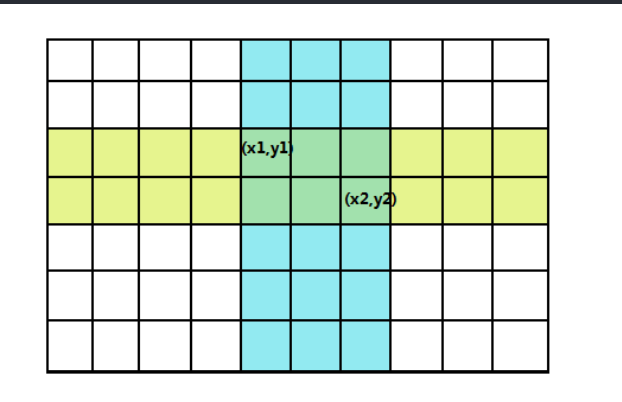

## T1 treasure
&emsp; 这个神奇的题，好像很简单，但是好像就像不出来怎么做。当然 40 分的暴力是很好想的。我们发现两条河的贡献能分开算。就分别维护两个数组 $r[]$ 和 $c[]$ 表示第 i 行有多少个宝藏和第 $i$ 列有多少个宝藏，维护一个前缀和。再处理处两个数组 $f$ 和 $g$，分别表示横着的河中宝物有 $i$ 个的情况数和竖着的河中宝物有 $i$ 个的情况数。然后答案就是 $ans = \sum_{i=1}^k f[i]g[k-i]$。时间复杂度：$O(n^2+m^2+k)$

```cpp
#include<bits/stdc++.h>
using namespace std;
#define in read()
#define MAXN 100100
#define MAXM 101
#define MAXA (int)(1e7 + 10)
#define endl '\n'
typedef long long ll;

inline int read(){
	int x = 0; char c = getchar();
	while(c < '0' or c > '9') c = getchar();
	while('0' <= c and c <= '9'){
		x = x * 10 + c - '0'; c = getchar();
	}
	return x;
}

int k = 0;
int n = 0; int m = 0;
int r[MAXN] = { 0 };
int c[MAXM] = { 0 };
int sr[MAXN] = { 0 };
int sc[MAXM] = { 0 };
int f[MAXA] = { 0 };
int g[MAXA] = { 0 };

int main(){
	n =  in; m = in; k = in;
	for(int i = 1; i <= n; i++){
		scanf("\n");
		for(int j = 1; j <= m; j++){
			char ch; scanf("%c", &ch);
			if(ch == '$') r[i]++, c[j]++;
		}
	}
	for(int i = 1; i <= n; i++) sr[i] = sr[i-1] + r[i];
	for(int i = 1; i <= m; i++) sc[i] = sc[i-1] + c[i];
	if(n <= 100 and m <= 100){                              // case 40%
		for(int len = 1; len <= n; len++)
			for(int l = 1; l <= n - len + 1; l++){
				int r = l + len - 1;
				f[sr[r] - sr[l-1]]++;
			}
		for(int len = 1; len <= m; len++)
			for(int l = 1; l <= n - len + 1; l++){
				int r = l + len - 1;
				g[sc[r] - sc[l-1]]++;
			}
		ll ans = 0;
		for(int i = 1; i <= k; i++) ans += 1ll * f[i] * g[k-i];
		cout << ans << endl;
	}
	else{                                                   // 考场上没想出来正解 
		for(int len = 1; len <= n; len++)
			for(int l = 1; l <= n - len + 1; l++){
				int r = l + len - 1;
				f[sr[r] - sr[l-1]]++;
			}
		for(int len = 1; len <= m; len++)
			for(int l = 1; l <= n - len + 1; l++){
				int r = l + len - 1;
				g[sc[r] - sc[l-1]]++;
			}
		ll ans = 0;
		for(int i = 1; i <= k; i++) ans += 1ll * f[i] * g[k-i];
		cout << ans << endl;
	}
	return 0;
}
```
&emsp; 下面是正解了。首先对一开始的矩阵维护一个矩阵前缀和和一个矩阵后缀和。然后我们要求一个是十字里面的宝藏数就可以由几个前缀和后缀加加减减凑出来，具体是这样的：



&emsp; 我们用 $(x_2, y_2)$ 的前缀减去 $(x_1-1, y_1-1)$ 的前缀和就能得到十字的 "上" + "左" + "中"（我们把左边的黄色部分叫做 "左"，有边的黄色部分叫做 "右"，上面的蓝色部分叫做 "上"，下面的蓝色部分叫做 "下"，中间的绿色部分叫做 "中"）。然后我们用 $(x_1, y_1)$ 的后缀和减去 $(x_2+1, y_2+1)$ 的后缀和就能得到十字的 "下"  + "右" + "中"。然后我们把这两部分加起来就是我们想要的整个十字架（"中" 要被算两次，不用去重）。

&emsp; 然后我们假设我们处理出来的矩阵前缀和是 $f$，后缀和是 $g$。那么根据上面的推理，一个十字架里的宝藏总数就应该是：
$$ f[x_2, y_2] - f[x_1-1, y_1-1] + g[x_1, y_1] - g[x_2+1, y_2+1] $$

&emsp; 再稍微整理一下：
$$ g[x_1, y_1] - f[x_1-1, y_1-1] + f[x_2, y_2]  - g[x_2+1, y_2+1] $$

&emsp; 然后我们发现整个十字架就能用两个点来表示。所以我们可以枚举第一个点，然后用树状数组找第二个点的所有的情况数。就能做到 $O(nm\log m)$ 了。具体这样维护，我们先处理处一个 $a$ 数组表示第一个点 $(x_2, y_2)$ 对十字架的贡献 ~~（不要问我为什么 $(x_2, y_2)$ 是第一个点，因为我愿意 qwq）~~。也就是：
$$ a[i, j] = f[i, j] - g[i+1, j+1] $$

&emsp; 然后我们先枚举第一个点的横坐标，然后枚举第一个点的纵坐标，并把它放进第 $s[a[i, j]]$ 个树状数组的第 $j$ 位里。这样，每次我们推出这个第二层循环的时候，我们就已经处理了所有的前 $i$ 行的点进树状数组里面，然后我们再枚举一次纵坐标进行查操作查询的就一定是比这个点横坐标纵坐标都要小的满足条件的点。

&emsp; 代码：
```cpp
#include<bits/stdc++.h>
using namespace std;
#define in read()
#define MAXN 100100
#define MAXM 101
#define MAXK 100100

inline int read(){
	int x = 0; char c = getchar();
	while(c < '0' or c > '9') c = getchar();
	while('0' <= c and c <= '9'){
		x = x * 10 + c - '0'; c = getchar();
	}
	return x;
}

struct BIT{
	int c[MAXM];
	
	inline int lowbit(int x){
		return x & -x;
	}
	void add(int x, int v){
		if(!x) c[0] += v;
		for(; x < MAXM and x; x += lowbit(x))
			c[x] += v;
	}
	int query(int x){
		int ans = 0;
		for(; x; x -= lowbit(x)) ans += c[x];
		return ans + c[0];
	}
}s[MAXK * 3];

int k = 0;
int n = 0; int m = 0;
int cnt = 0; int ans = 0;
int f[MAXN][MAXM] = { 0 };
int g[MAXN][MAXM] = { 0 };
int a[MAXN][MAXM] = { 0 };

int main(){
	n = in; m = in; k = in;
	for(int i = 1; i <= n; i++){
		scanf("\n");
		for(int j = 1; j <= m; j++)
			if(getchar() == '$'){ f[i][j]++; g[i][j]++; cnt++; }
	}
	for(int i = 1; i <= n; i++)
		for(int j = 1; j <= m; j++)
			f[i][j] += f[i-1][j] + f[i][j-1] - f[i-1][j-1];
	for(int i = n; i; i--)
		for(int j = n; j; j--)
			g[i][j] += g[i+1][j] + g[i][j+1] - g[i+1][j+1];
	for(int i = 0; i <= n; i++)
		for(int j = 0; j <= m; j++)
			a[i][j] = f[i][j] - g[i+1][j+1];
	for(int i = 1; i <= n; i++){
		for(int j = 0; j < m; j++){
			s[a[i-1][j] + 2*cnt].add(j, 1);               // a[i][j] 可能是负数所以加上 2cnt
		}
		for(int j = 1; j <= m; j++)
			ans += s[a[i][j] - k + 2*cnt].query(j-1);
	}
	cout << ans << endl;
	return 0;
}
```


## T2 qwq
&emsp; 一道小清新的概率期望题（考场上做出了 70 分，太感动了），我们拿第一个样例举例子，首先初始的时候三人都是 1，即 $1, 1, 1$。然后第一轮第一个人给，那他就变成 0。其他两人得到的个数期望都是 $\frac 12$ 所以两人都加上 $\frac 12$ 就变成了：$0, \frac 32 , \frac 32$。然后下一轮第二个人给，所以他的就变成 0，然后其他两人得到的数的期望就都是 $\frac 34$，所以两人都加上 $\frac 34$ 就变成了：$\frac 34, 0, \frac 94$。最后一次第三个人给，所以它变成 0，其他两人的期望得到的数都是 $\frac 98$，然后就都加上 $\frac 98$ 变成 $\frac{15}8, \frac 98, 0$。这个就是答案了。这样模拟下来很显然就是 $O(n^2)$ 的。
```cpp
#include<bits/stdc++.h>
using namespace std;
#define MOD 998244353
#define MAXN 1001000

int qp(int a, int b){
	int ans = 1 % MOD;
	for(; b; b >>= 1){
		if(b & 1) ans = 1ll * ans * a % MOD;
		a = 1ll * a * a % MOD;
	}
	return ans;
}

int n = 0;
int a[MAXN] = { 0 };

int main(){
	scanf("%d", &n);
	for(int i = 1; i <= n; i++) scanf("%d", &a[i]);
	if(n <= 5000){                                      // case 70%
		int invnm1 = qp(n-1, MOD-2);
		for(int i = 1; i <= n; i++){
			int add = 1ll * a[i] * invnm1 % MOD;
			a[i] = 0;
			for(int j = 1; j <= n; j++)
				if(j != i) a[j] = (a[j] + add) % MOD;
		}
		for(int i = 1; i <= n; i++) cout << a[i] % MOD << ' ';
		puts("");	
	}
	else{                                               // 考场上没想出来正解 * 2
		int invnm1 = qp(n-1, MOD-2);
		for(int i = 1; i <= n; i++){
			int add = 1ll * a[i] * invnm1 % MOD;
			a[i] = 0;
			for(int j = 1; j <= n; j++)
				if(j != i) a[j] = (a[j] + add) % MOD;
		}
		for(int i = 1; i <= n; i++) cout << a[i] % MOD << ' ';
		puts("");
	}
	return 0;
}
```

&emsp; 正解：我们令 $f_i$ 表示操作到第 $i$ 个人的时候他的期望的个数，那么我们有：
$$ f_i = f_i + \frac{\sum\limits_{j=1}^{i-1}f_j}{n-1} $$

&emsp; 然后答案序列就是：
$$ ans_i = \frac{\sum\limits_{j=i+1}^n f_j}{n-1} $$

```cpp
#include<bits/stdc++.h>
using namespace std;
#define MAXN 1001000
#define MOD 998244353

int n = 0;
int f[MAXN] = { 0 };
int ans[MAXN] = { 0 };

inline int add(int x, int y){
	return x + y < MOD ? x + y : x + y - MOD;
}

int qp(int a, int n) {
	int ans = 1 % MOD;
	for(; b; b >>= 1){
		if(b & 1) ans = 1ll * ans * a % MOD;
		a = 1ll * a * a % MOD;
	}
	return ans;
}

int main() {
  scanf("%d", &n);
  for (int i = 1; i <= n; i++) scanf("%d", &f[i]);
  int iv = qp(n - 1, MOD - 2);
  for (int i = 1, s = 0; i <= n; i++)
    f[i] = (f[i] + 1ll * s * iv) % MOD, s = add(s, f[i]);
  for (int i = n, s = 0; i; i--)
    ans[i] = 1ll * s * iv % MOD, s = add(s, f[i]);
  for (int i = 1; i <= n; i++) cout << ans[i] << ' ';
  puts("");
}
```