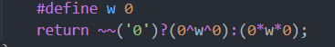

&emsp; 今天的 std 可能有他自己的想法 qwq。


## T1 pump
&emsp; 看着这个题的体面就很像最大流，然后打了个最大流，然后，30 分....

&emsp; 考完之后发现只用多跑几遍 dijkstra 就好了，首先，放流量最小固定的时候，我们只需要求出最小的 $\sum c$ 就可以了，然后我们就枚举 $\min f$，对于 $\geq f$ 的边建图，然后在这张图上跑 djikstra 就好了。

## T2 milk
&emsp; 这题貌似有很多种解法，LCA，并查集，树剖都可以，我写的是并查集。就是把所有连成一片的同一种类的放到一个并查集里，然后查找的时候只要起点和终点在同一个并查集然后种类是相反的就是 0 其他都是 1。

```cpp
#include<bits/stdc++.h>
using namespace std;
#define in read()
#define MAXN 100100
#define MAXM 100100

inline int read(){
	int x = 0; char c = getchar();
	while(c < '0' or c > '9') c = getchar();
	while('0' <= c and c <= '9'){
		x = x * 10 + c - '0'; c = getchar();
	}
	return x;
}

char ss[MAXN];
int n = 0; int m = 0;
int ans[MAXM] = { 0 };

int fa[MAXN] = { 0 };

void init(){
	for(int i = 0; i <= n; i++) fa[i] = i;
}

int find(int x){
	if(x == fa[x]) return x;
	return fa[x] = find(fa[x]);
}

void merge(int x, int y){
	fa[find(x)] = find(y);
}

int main(){
	freopen("milk.in", "r", stdin);
	freopen("milk.out", "w", stdout);
	n = in; m = in;
	init();
	scanf("%s", ss+1);
	for(int i = 1; i < n; i++){
		int x = in; int y = in;
		if(ss[x] == ss[y]) merge(x, y);
	}
	for(int i = 1; i <= m; i++){
		int s = in; int t = in;
		char temp = getchar();
		if(find(s) == find(t) and ss[s] != temp) ans[i] = 0;
		else ans[i] = 1;
	}
	for(int i = 1; i <= m; i++) cout << ans[i];
	puts("");
	return 0;
}
```

## T3 visit
&emsp; 就是 T2 的加强版，但是如果用并查集的话空间就是 $O(n^2)$ 的，所以不行，考场上也没想出来其他的解法。

&emsp; 整洁似乎是树剖 + 树套树（线段树套平衡树）。就是对线段树的每一个节点维护一个 set 记录区间内有哪几种奶牛，然后就很简单了。

&emsp; 代码调了一下午，实在找不出来啥问题，附上我的代码和 std。
```cpp
// 我的
#include<bits/stdc++.h>
using namespace std;
#define in read()
#define MAXN 100100
#define MAXM 2 * MAXN
#define ls(p) (p << 1)
#define rs(p) (p << 1 | 1)
#define endl '\n'

inline int read(){
    int x = 0; char c = getchar();
    while(c < '0' or c > '9') c = getchar();
    while('0' <= c and c <= '9'){
        x = x * 10 + c - '0'; c = getchar();
    }
    return x;
}

int a[MAXN] = { 0 };
int n = 0; int m = 0;

int tot = 0;
int first[MAXN] = { 0 };
int   nxt[MAXM] = { 0 };
int    to[MAXM] = { 0 };

inline void add(int x, int y){
    nxt[++tot] = first[x];
    first[x] = tot; to[tot] = y;
}

int  dep[MAXN] = { 0 };
int   fa[MAXN] = { 0 };
int size[MAXN] = { 0 };
int  son[MAXN] = { 0 };
void dfs1(int x, int father,  int depth){
    dep[x] = depth; fa[x] = father; size[x] = 1;
    for(int e = first[x]; e; e = nxt[e]){
        int y = to[e];
        if(y != father){
            dfs1(y, x, depth+1);
            size[x] += size[y];
            if(size[y] > size[son[x]]) son[x] = y;
        }
    }
}

int cnt = 0;
int top[MAXN] = { 0 };
int idx[MAXN] = { 0 };
int pos[MAXN] = { 0 };
void dfs2(int x, int t){
    top[x] = t; idx[x] = ++cnt; pos[cnt] = x;
    if(!son[x]) return;
    dfs2(son[x], t);
    for(int e = first[x]; e; e = nxt[e]){
        int y = to[e];
        if(y != fa[x] and y != son[x]) dfs2(y, y);
    }
}

set<int> s[MAXN * 4];
void build(int p, int l, int r){
    for(int i = l; i <= r; i++)
        s[p].insert(a[pos[i]]);
    if(l == r) return;
    int mid = (l + r) >> 1;
    build(ls(p), l, mid);
    build(rs(p), mid + 1, r);
}

bool search(int p, int l, int r, int ql, int qr, int x){
    if(l > qr or r < ql) return false;
    if(ql <= l and r <= qr)
        return s[p].count(x);
    int mid = (l + r) >> 1;
    bool ll = search(ls(p), l, mid, ql, qr, x);
    bool rr = search(rs(p), mid + 1, r, ql, qr, x);
    return ll or rr;
}

bool lca(int x, int y, int v){
    while(top[x] != top[y]){
        if(dep[top[x]] < dep[top[y]]) swap(x, y);
        if(search(1, 1, n, idx[top[x]], idx[x], v))
            return true;
        x = fa[top[x]];
    }
    if(dep[x] < dep[y]) swap(x, y);
    return search(1, 1, n, idx[x], idx[y], v);
}

int ans[MAXN] = { 0 };
int main(){
    n = in; m = in;
    // printf("n = %d m = %d\n", n, m);
    for(int i = 1; i <= n; i++)  a[i] = in;
    for(int i = 1; i < n; i++){
        int x = in; int y = in;
        add(x, y); add(y, x);
    }
    dfs1(1, 0, 1); dfs2(1, 1); build(1, 1, n);
    for(int i = 1; i <= m; i++){
        int x = in; int y = in; int v = in;
        ans[i] = lca(x, y, v); 
    }
    for(int i = 1; i <= m; i++) cout << ans[i];
    puts("");
    return 0;
}
```
```cpp
// std
#include <bits/stdc++.h>
using namespace std;

#define N 100005

inline void rd(int &x){
    x=0;char c=getchar();
    while(c<'0'||c>'9')c=getchar();
    while(c>='0'&&c<='9')x=x*10+c-'0',c=getchar();
}

int n,m,a[N];
int hd[N],_hd;

struct edge{
    int v,nxt;
}e[N<<1];

inline void addedge(int u,int v){
    e[++_hd]=(edge){v,hd[u]};
    hd[u]=_hd;
}

int fa[N],dep[N],sz[N],son[N];

inline void dfs1(int u,int Fa){
    fa[u]=Fa;
    dep[u]=dep[Fa]+1;
    sz[u]=1;
    for(int i=hd[u];i;i=e[i].nxt){
        int v=e[i].v;
        if(v==Fa)
            continue;
        dfs1(v,u);
        sz[u]+=sz[v];
        if(sz[v]>sz[son[u]])
            son[u]=v;
    }
}

int id[N],_id,pos[N],top[N];

inline void dfs2(int u){
    id[u]=++_id;
    pos[_id]=u;
    top[u]=u==son[fa[u]]?top[fa[u]]:u;
    if(son[u])
        dfs2(son[u]);
    for(int i=hd[u];i;i=e[i].nxt){
        int v=e[i].v;
        if(v==fa[u]||v==son[u])
            continue;
        dfs2(v);
    }
}

std::set<int> s[N<<2];
inline void build(int p,int L,int R){
    for(int i=L;i<=R;i++)
        s[p].insert(a[pos[i]]);
    if(L==R)
        return;
    int mid=(L+R)>>1;
    build(p<<1,L,mid);
    build(p<<1|1,mid+1,R);
}

inline bool sch(int p,int L,int R,int l,int r,int x){
    if(L>r||R<l)
        return 0;
    if(l<=L&&R<=r)
        return s[p].count(x);
    int mid=(L+R)>>1;
    return sch(p<<1,L,mid,l,r,x)||sch(p<<1|1,mid+1,R,l,r,x);
}

inline bool lca_sch(int u,int v,int x){
    while(top[u]!=top[v]){
        if(dep[top[u]]<dep[top[v]])
            std::swap(u,v);
        if(sch(1,1,n,id[top[u]],id[u],x))
            return 1;
        u=fa[top[u]];
    }
    if(dep[u]<dep[v])
        std::swap(u,v);
    return sch(1,1,n,id[v],id[u],x);
}

int main(){
	freopen("visit.in","r",stdin);
	freopen("visit.out","w",stdout);
    rd(n),rd(m);
    for(int i=1;i<=n;i++)
        scanf("%d",&a[i]);
    for(int i=1;i<n;i++){
        int u,v;
        rd(u),rd(v);
        addedge(u,v);
        addedge(v,u);
    }
    dfs1(1,0);
    dfs2(1);
    build(1,1,n);
    while(m--){
        int u,v,x;
        rd(u),rd(v),rd(x);
        printf("%d",lca_sch(u,v,x));
    }
    #define w 0
    return ~~('0')?(0^w^0):(0*w*0);
}

```