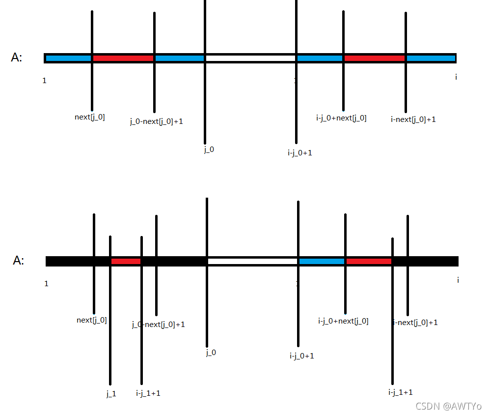

# KMP 详解

&emsp; 蒟蒻来学习 KMP 算法啦....

&emsp; 其实我之前也学过一遍这玩意儿，但是里面的 next 数组始终没搞懂是咋弄出来的，所以今天来写一个详细解释 next 数组求法的文章（~~顺便把 KMP 说完qwq~~）

&emsp; 首先是百度对 KMP 的一些简单的介绍：

> ​
KMP算法是一种改进的字符串匹配算法，由D.E.Knuth，J.H.Morris和V.R.Pratt提出的，因此人们称它为克努特—莫里斯—普拉特操作（简称KMP算法）。KMP算法的核心是利用匹配失败后的信息，尽量减少模式串与主串的匹配次数以达到快速匹配的目的。具体实现就是通过一个next()函数实现，函数本身包含了模式串的局部匹配信息。KMP算法的时间复杂度O(m+n)

&emsp; ​其实这个问题也能用字符串 Hash 在线性的时间内解决掉，我们先用一个 O(M + N) 搞定 Hash 对于两个字符串 A 和 B 的预处理，然后可以每次用 O(1) 的复杂度查询到 A 的哈希值是否和 B 的子串 B[i - N + 1~i]（N <= i <= M） 的哈希值是否相同。就搞定了。所以总的时间复杂度应该就是 O(2M)。然而我们的 KMP 算法的时间复杂度是 O(N+M) 显然要比 Hash 的小（~~因为 A 的长度 N 显然比 B 的长度 M 要小嘛~~）。所以我们接下来就来看一些 KMP 算法的具体实现步骤。

--------

&emsp; 步骤如下：

1. 对字符串 A 进行 "自我匹配" （~~其实就是求解 next 数组~~）
2. 对字符串 A 和 B 用上面几乎一样的方法进行匹配，求出一个 f 数组。

&emsp; 接下来我们说一下 next 数组的定义：next[i] 表示的是 "A 中以 i 结尾的非前缀子串" 和 "A 的前缀" 能够匹配到的最长长度。很显然这句话看着就不太好懂，那么我们给出一个更简洁的描述：

$$ next[i] = max{ j }， 其中 j < i 并且 A[i - j + 1 ~ i] = A[1 ~ j] $$

&emsp; ~~是不是很好懂qwq~~。要是还是看不懂的话也没关系，我们来举个例子。比如在这样一个字符串 A = "abababaac" 中，我们要求求得 next[7] 的值。首先我们把前 7 个字符拎出来 "abababa"。我们可以发现这七个字符中前五个和后五个如果单独拿出来是完全一样的，都是 "ababa" 而且我们已经找不到更长的 j 使得前 j 个和后 j 个是完全一样的了。所以我们找到了最大的 j < i 使得 A[i-j+1~i] = A[1~j]。那么next[ i ~~(i=7)~~ ] = max{ j } = 5。

&emsp; ​
然后我们来看一下具体怎么求解 next 数组。（朴素的 $O(n^2)$ 的方法就不说了，直接上正解）要理解 next 数组的求法，我们先要研究一下这个 next 数组的一些奇妙的性质。

## 引理

&emsp; ​
若 $j_0$ 是 $next[i]$ 的候选项，即 $j_0 < i$ 且 $A[i -j_0 +1 \sim i] = A[1 \sim j_0]$ （就是下图最大的两个区间）但是 可能不是最大的 $j$。则小于  的最大 $next[i]$  的候选项就是 $next[j_0]$ （就是下图小的蓝色的区间，又因为大的区间相等，所以后面的部分也可以填充为蓝色 就是说也相等qwq）。换句话说，$next[j_0] +1 \sim j_0 - 1$ 之间是没有 $next[i]$ 的候选项的。

&emsp; 是不是很神奇，我们现在考虑证明这个引理：

&emsp; ​
反证法：假设存在 $next[j_0] < j_1 < j_0$  使得  为 $next[i]$ 的候选项。即 $A[i - j_1 + 1 \sim i] = A[1\sim j_1 ]$ （就是下图的第二张图中的黑色部分）。又因为最长的两段区间是相等的所以说 $A[1~\sim j_1] = A[i-j_1+1\sim i]$（就是说前面那一小段区间的前半段和后半段都可以填充为黑色）那就说明 $j_1$ 就是 $next[j_0]$ 的一个候选项，而且 $j_1 > next[j_0]$ 与 $next$ 数组的定义相违背。所以不可能存在这样的 。

​​

&emsp; ​
知道了这个引理，我们就能知道如何在线性时间内求出 next 数组了。根据引理，当 $next[i-1]$ 计算完毕时，我们就可以知道 $next[i-1]$ 的所有候选项分别从大到小依次为 $next[i-1]$，$next[next[i-1]]$，$next[next[next[i-1]]]$  而且我们很容易知道，如果一个数 $j$ 是 $next[i]$ 的候选项，那么 $j-1$ 一定是 $next[i-1]$ 的候选项。所以我们在计算 $next[i]$ 时只需要把 $next[i-1] + 1$, $next[next[i-1]] +1$, $next[next[next[i-1]]] +1$  且 $A[i] = A[j+1]$ 的作为 $next[i]$ 的候选项就能算出 $next[i]$ 了。

​&emsp; 具体步骤如下：

1. 初始化 $next[1] = j = 0$，假设 $next[1~i-1]$ 已经求出来了。然后求解 $next[i]$
2. 不断尝试扩展 $j$，（判断 $A[i] == =A[j+1]$），如果扩展失败，让 $j = next[j]$，直到 $j = 0$。
3. 如果扩展成功，$j++$。$next[i] = j$;


```c++
next[1] = 0;
for(int i = 2; j = 0; i <= n; i++){
    while(j > 0 and a[j+1] != a[i]){
        j = next[j];
    }
    if(a[j+1] == a[i]){
        j++;
    }
    next[i] = j;
}
```

&emsp; 求出来了 next 数组，我们就来到了 KMP 算法的第二步，就是求解 f 数组。（这么半天才到第二步其实总共也就两步qwq）我们老规矩，先看 f 数组的定义。这次直接放 "直观的形式"：

$$  f[i] = max{ j }，其中 j <= i 且 B[i-j+1 ~ i]  =  A[1 ~ j] $$

&emsp; 然后我们就会发现，f 数组的定义和 next 数组的定义及其一致，可以说几乎一摸一样。所以求解 f 数组的方法也和求解 next 数组的方法几乎一摸一样。那么我就不过多赘述了，直接上代码：

```c++
for(int i = 1, j = 0; i <= m; i++){
    while(j > 0 and b[i] == a[j + 1]){
        j = next[j];
    }
    if(b[i] == a[j + 1]){
        j++;
    }
    f[i] = j;
}
```

&emsp;  整个 KMP 算法的主要部分就结束啦......完整的代码我放在下面啦.....

```c++
#include<bits/stdc++.h>
using namespace std;

#define MAXN 10010

char a[MAXN];
char b[MAXN];

int nxt[MAXN] = { 0 };
int   f[MAXN] = { 0 };
void KMP(int n, int m){
	nxt[1] = 0;
	for(int i = 2, j = 0; i <= n; i++){
		while(j > 0 and a[i] != a[j+1])
			j = nxt[j];
		if(a[i] == a[j+1])
			j++;
		nxt[i] = j;
	}
	
	for(int i = 1, j = 0; i <= m; i++){
		while(j > 0 and b[i] != a[j+1])
			j = nxt[j];
		if(b[i] == a[j+1])
			j++;
		f[i] = j;
	}
}

int main(){
	scanf("%s%s", b + 1, a + 1);
	int n = strlen(a + 1);
	int m = strlen(b + 1);
	
	KMP(n, m);
	for(int i = 1; i <= m; i++){
		printf("%d ", f[i]);
	}
	puts("");
	
	return 0;
}
```